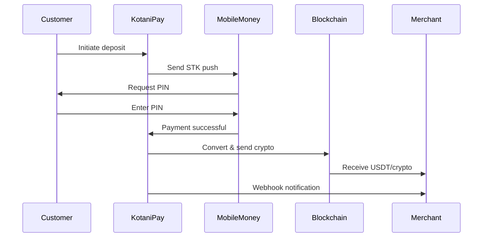

<Warning>
This endpoint is marked as **deprecated** but is fully functional. It will be replaced with a clearer naming convention in the future.
</Warning>

## Use Case

This endpoint is for **e-commerce platforms and businesses that want to accept mobile money payments and receive the equivalent in cryptocurrency**.

**Perfect for:**
- E-commerce platforms accepting crypto payments
- Merchants wanting to receive payments in stablecoins
- Platforms converting fiat payments to crypto automatically

**NOT for:**
- Selling crypto to customers (use `/onramp` instead)
- Running a crypto exchange

## How It Works

1. Your customer pays via mobile money (STK push)
2. We collect the mobile money payment
3. We convert the fiat to crypto at current rates
4. **Your crypto wallet receives the USDT/crypto**
5. You fulfill the customer's order

## Flow



## Key Differences

| Aspect | This Endpoint (Deposit On-Chain) | Onramp Endpoint |
|--------|-----------------------------------|-----------------|
| Who receives crypto? | ✅ **You** (the merchant) | Customer |
| Who receives fiat? | Payment processor | ✅ **You** (the merchant) |
| Crypto inventory needed? | ❌ No | ✅ Yes (must have crypto to sell) |
| Use case | Accept payments in crypto | Sell crypto to customers |

## Examples

### Receive crypto to your wallet

When you DON'T provide `public_address`, crypto goes to your wallet:

```json
{
  "customer_key": "cus_abc123",
  "wallet_id": "wallet_polygon_usdt_xyz",
  "amount": 1450,
  "chain": "POLYGON",
  "token": "USDT",
  "callback_url": "https://yourdomain.com/webhook",
  "reference_id": "order_12345"
}
```

**Result:** You receive ~0.65 USDT in your POLYGON wallet

### Send crypto to customer's address

When you provide `public_address`, crypto goes directly to that address:

```json
{
  "customer_key": "cus_abc123",
  "wallet_id": "wallet_polygon_usdt_xyz",
  "amount": 1450,
  "chain": "POLYGON",
  "token": "USDT",
  "public_address": "0x742d35Cc6634C0532925a3b844Bc454e4438f44e",
  "callback_url": "https://yourdomain.com/webhook",
  "reference_id": "order_12345"
}
```

**Result:** Customer receives ~0.65 USDT at their address

## Supported Chains & Tokens

Get supported chains and tokens:

```bash
GET /api/v3/deposit/on-chain/supported-chains
```

Response:
```json
{
  "data": {
    "POLYGON": ["USDT", "USDC"],
    "ETHEREUM": ["USDT", "USDC"],
    "CELO": ["CUSD"],
    "STELLAR": ["USDC"],
    "SOLANA": ["USDT", "USDC"]
  }
}
```

## Status Tracking

Track your deposit status:

```bash
GET /api/v3/deposit/on-chain/status/{reference_id}
```

See [Get Deposit On-Chain Status](/v3/api-reference/deposits/deposit-on-chain-status) for details.
