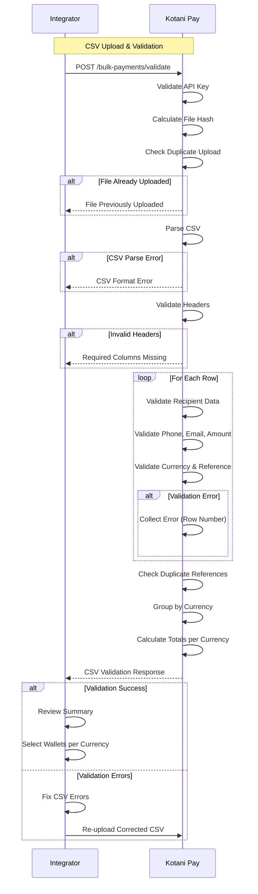
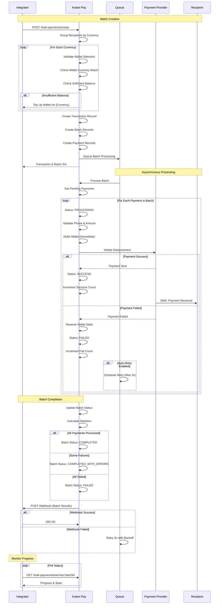
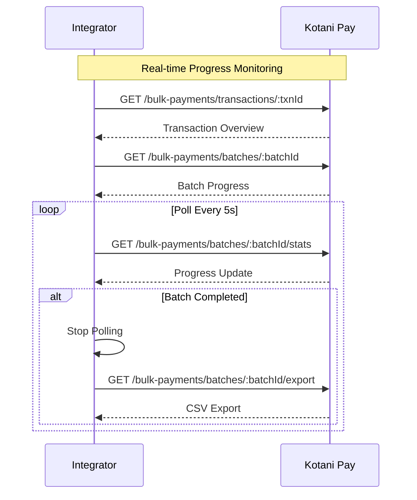

## Overview

Bulk payments support mass disbursements via:
- Mobile money payments
- Bank transfers

**Key Features**:
- CSV-based bulk upload
- Multi-currency support (one batch per currency)
- Automatic validation and duplicate detection
- Wallet balance verification
- Progress tracking with detailed status
- Automatic retry on failures
- Webhook notifications per batch
- Transaction grouping and reporting

**Processing Flow**:
1. Upload CSV with recipient details
2. Validate CSV format and data
3. Select wallet for each currency
4. Create batches (one per currency)
5. Process payments asynchronously
6. Track progress and receive webhooks

---

## CSV Upload and Validation Flow

Upload and validate recipient data via CSV file.

### Flow Diagram



### CSV Format

**Required Columns**:
- `recipient_name`: Full name of recipient
- `recipient_email`: Email address
- `recipient_phone`: Phone number with country code
- `amount`: Payment amount (numeric)
- `currency`: Currency code (KES, UGX, TZS, etc.)
- `reference`: Unique reference per payment

**Optional Columns**:
- `description`: Payment description/note
- `metadata`: Additional data (JSON string)

**Example CSV**:
```csv
recipient_name,recipient_email,recipient_phone,amount,currency,reference,description
John Doe,john@example.com,+254700000000,1000,KES,INV-001,January Salary
Jane Smith,jane@example.com,+256700000000,500000,UGX,INV-002,Commission Payment
Bob Johnson,bob@example.com,+254711000000,2500,KES,INV-003,Refund
```

### Validation Response

```json
{
  "isValid": true,
  "totalRecords": 150,
  "currencies": ["KES", "UGX", "TZS"],
  "currencyBreakdown": {
    "KES": {
      "count": 100,
      "totalAmount": 150000
    },
    "UGX": {
      "count": 30,
      "totalAmount": 15000000
    },
    "TZS": {
      "count": 20,
      "totalAmount": 500000
    }
  },
  "fileHash": "md5_hash_here",
  "isDuplicate": false,
  "errors": [],
  "warnings": [
    "Row 45: Phone format may be invalid"
  ]
}
```

**Key Points**:
- File hash prevents duplicate uploads
- Each row validated individually
- Errors include row numbers for easy correction
- Currency automatically detected and grouped
- Totals calculated per currency (never mixed)
- Duplicate references within CSV detected

---

## Batch Creation and Processing Flow

Create payment batches and process disbursements.

### Flow Diagram



### Details

**Batch Processing**:
- One batch created per currency
- Batches linked to parent transaction
- Each batch processes independently
- Asynchronous processing via queue
- Progress tracked at batch and payment level

**Wallet Debit**:
- Immediate debit when payment initiated
- Automatic reversal on failure
- Balance verification before batch creation
- Separate wallet required per currency

**Payment Statuses**:
- `PENDING`: Awaiting processing
- `PROCESSING`: Payment being sent
- `SUCCESS`: Payment delivered
- `FAILED`: Payment failed (wallet reversed)
- `RETRY`: Queued for retry

**Batch Statuses**:
- `pending`: Batch created, awaiting processing
- `processing`: Payments being sent
- `completed`: All payments processed successfully
- `completed_with_errors`: Some payments failed
- `failed`: All payments failed
- `cancelled`: Batch cancelled by user

**Key Points**:
- Payments processed sequentially within batch
- Failed payments automatically reversed
- Up to 3 automatic retries per payment
- Detailed progress tracking per payment
- Webhooks sent per batch completion
- Transaction groups multiple batches

---

## Progress Tracking Flow

Monitor batch processing progress in real-time.

### Flow Diagram



### Progress Response

```json
{
  "transactionId": "txn_abc123",
  "transactionName": "January Payroll",
  "status": "processing",
  "totalBatches": 3,
  "completedBatches": 2,
  "failedBatches": 0,
  "batches": [
    {
      "batchId": "batch_001",
      "currency": "KES",
      "status": "completed",
      "totalPayments": 100,
      "successfulPayments": 98,
      "failedPayments": 2,
      "pendingPayments": 0,
      "totalAmount": 150000,
      "progress": [
        {
          "step": "validation",
          "status": "completed",
          "message": "CSV validation completed",
          "completedAt": "2024-01-15T10:00:00Z"
        },
        {
          "step": "creation",
          "status": "completed",
          "message": "Batch created with 100 payments",
          "completedAt": "2024-01-15T10:01:00Z"
        },
        {
          "step": "payment_processing",
          "status": "completed",
          "message": "98 successful, 2 failed",
          "completedAt": "2024-01-15T10:15:00Z"
        }
      ]
    },
    {
      "batchId": "batch_002",
      "currency": "UGX",
      "status": "processing",
      "totalPayments": 30,
      "successfulPayments": 15,
      "failedPayments": 0,
      "pendingPayments": 15,
      "totalAmount": 15000000,
      "progress": [
        {
          "step": "payment_processing",
          "status": "running",
          "message": "Processing payment 16 of 30",
          "startedAt": "2024-01-15T10:10:00Z"
        }
      ]
    }
  ]
}
```

**Key Points**:
- Transaction groups multiple currency batches
- Each batch tracks independently
- Progress steps: validation → creation → customer_creation → payment_processing → completion
- Real-time payment counts
- Failed payment details available
- Export results as CSV

---

## Mobile Money Bulk Disbursement

Bulk payments via mobile money networks.

### Payment Details

**Supported Networks**: M-PESA, Airtel Money, MTN Mobile Money, Tigo Pesa, Vodafone

**Supported Countries**: Kenya, Uganda, Tanzania, Ghana, Nigeria, Zambia

**Processing**:
- Automatic network detection from phone number
- Currency validation per country
- Direct disbursement to mobile wallets
- SMS confirmation sent to recipient
- Real-time status updates

**Typical Processing Time**: 5-30 seconds per payment

**Key Points**:
- No recipient registration required
- Works with any mobile money number
- Automatic currency conversion if needed
- Recipient receives SMS notification
- Failed payments reversed automatically

---

## Bank Transfer Bulk Disbursement

Bulk payments via bank transfers.

### Payment Details

**Supported Countries**: Kenya, South Africa

**Required Information**:
- Account holder name
- Account number
- Bank code
- Phone number (for verification)

**Processing**:
- Bank account validation
- Direct transfer to bank account
- Reference number provided per payment
- Email notification to recipient (if provided)

**Typical Processing Time**: Instant to 24 hours depending on bank

**Key Points**:
- Requires valid bank account details
- Inter-bank transfers may take longer
- Reference number for tracking
- Failed transfers reversed automatically
- Bank holidays may affect processing

---

## Webhook Notifications

Webhooks sent for batch status changes and completion.

### Webhook Events

**Batch Started**:
```json
{
  "event": "bulk_payment.batch.started",
  "timestamp": "2024-01-15T10:00:00Z",
  "data": {
    "transactionId": "txn_abc123",
    "batchId": "batch_001",
    "currency": "KES",
    "totalPayments": 100,
    "totalAmount": 150000,
    "status": "processing"
  }
}
```

**Batch Completed**:
```json
{
  "event": "bulk_payment.batch.completed",
  "timestamp": "2024-01-15T10:15:00Z",
  "data": {
    "transactionId": "txn_abc123",
    "batchId": "batch_001",
    "currency": "KES",
    "status": "completed",
    "totalPayments": 100,
    "successfulPayments": 98,
    "failedPayments": 2,
    "totalAmount": 150000,
    "successAmount": 147000,
    "failedAmount": 3000,
    "processingTime": 900,
    "failedPayments": [
      {
        "reference": "INV-045",
        "recipientPhone": "+254700000000",
        "amount": 1500,
        "reason": "Invalid phone number"
      },
      {
        "reference": "INV-078",
        "recipientPhone": "+254711000000",
        "amount": 1500,
        "reason": "Recipient account unavailable"
      }
    ]
  }
}
```

**Transaction Completed**:
```json
{
  "event": "bulk_payment.transaction.completed",
  "timestamp": "2024-01-15T10:20:00Z",
  "data": {
    "transactionId": "txn_abc123",
    "transactionName": "January Payroll",
    "status": "completed",
    "totalBatches": 3,
    "completedBatches": 3,
    "failedBatches": 0,
    "totalPayments": 150,
    "successfulPayments": 145,
    "failedPayments": 5,
    "currencyBreakdown": {
      "KES": {
        "totalAmount": 150000,
        "successAmount": 147000,
        "successful": 98,
        "failed": 2
      },
      "UGX": {
        "totalAmount": 15000000,
        "successAmount": 14500000,
        "successful": 29,
        "failed": 1
      },
      "TZS": {
        "totalAmount": 500000,
        "successAmount": 460000,
        "successful": 18,
        "failed": 2
      }
    }
  }
}
```

**Key Points**:
- Webhooks sent per batch and per transaction
- Include failed payment details
- HMAC signature for verification
- Automatic retry on webhook failure
- Detailed breakdown by currency

---

## Best Practices

### CSV Preparation
- Use UTF-8 encoding
- Include all required columns
- Use E.164 phone format (+254...)
- Ensure unique references
- Validate data before upload
- Keep file size under 10MB
- Maximum 1000 recipients per upload

### Wallet Management
- Ensure sufficient balance before upload
- Use separate wallets per currency
- Monitor wallet balance during processing
- Set up low balance alerts
- Top up wallets during business hours

### Error Handling
- Review validation errors before submission
- Monitor failed payments
- Retry failed payments manually if needed
- Keep audit trail of all uploads
- Export results for reconciliation

### Performance
- Process during off-peak hours for faster completion
- Split very large batches (>500 payments)
- Use transaction grouping for related batches
- Monitor progress via API or webhooks
- Cache batch status to reduce API calls

### Security
- Verify webhook signatures
- Store sensitive recipient data securely
- Use HTTPS for all callbacks
- Implement idempotency in webhook handlers
- Rotate API keys regularly

---

## Error Handling

### CSV Validation Errors
```json
{
  "statusCode": 400,
  "message": "CSV validation failed",
  "errors": [
    "Row 12: Missing recipient name",
    "Row 45: Invalid email format",
    "Row 67: Amount must be positive",
    "Row 89: Invalid currency code 'XXX'",
    "Duplicate references found: INV-001, INV-002"
  ]
}
```

### Insufficient Balance
```json
{
  "statusCode": 400,
  "message": "Insufficient wallet balance",
  "details": {
    "currency": "KES",
    "required": 150000,
    "available": 100000,
    "shortfall": 50000
  }
}
```

### Batch Processing Errors
```json
{
  "batchId": "batch_001",
  "status": "completed_with_errors",
  "summary": {
    "total": 100,
    "successful": 95,
    "failed": 5
  },
  "failedPayments": [
    {
      "reference": "INV-012",
      "reason": "Invalid phone number",
      "walletReversed": true
    },
    {
      "reference": "INV-034",
      "reason": "Network timeout",
      "retryScheduled": true,
      "nextRetryAt": "2024-01-15T11:00:00Z"
    }
  ]
}
```

---

## Testing

Sandbox mode test data:

**Test CSV Upload**: Use sample CSV with test data

**Test Phone Numbers**:
- Success: `+254700000000` (Kenya)
- Failure: `+254799999999` (Invalid number)
- Timeout: `+254788888888` (Network timeout)

**Test Amounts**:
- Amounts ending in `00` trigger success
- Amounts ending in `99` trigger failure
- Amounts ending in `50` trigger retry

**Test Scenarios**:
- Upload 10 recipients: All succeed
- Upload 20 recipients: 18 succeed, 2 fail
- Upload 5 recipients with same currency: Test wallet selection
- Upload 15 recipients with 3 currencies: Test multi-batch creation

**Test Wallets**: Sandbox wallets pre-funded with test balances
