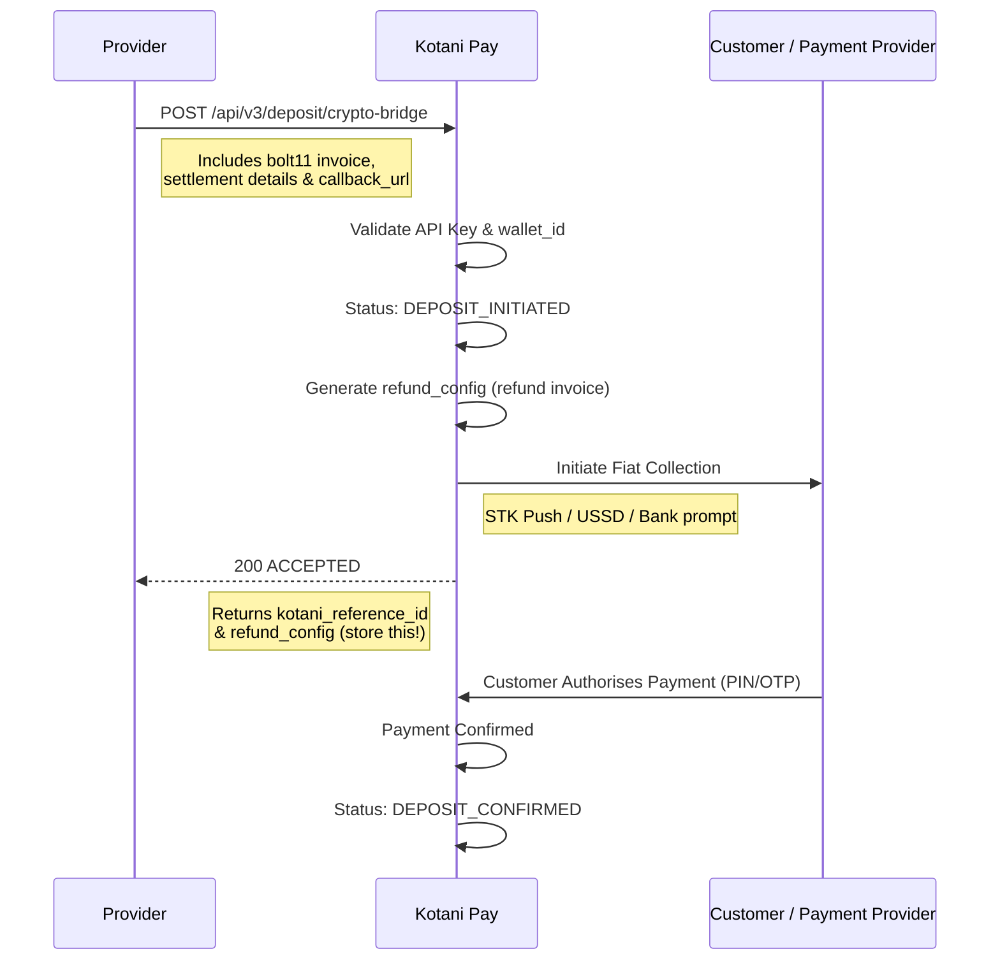
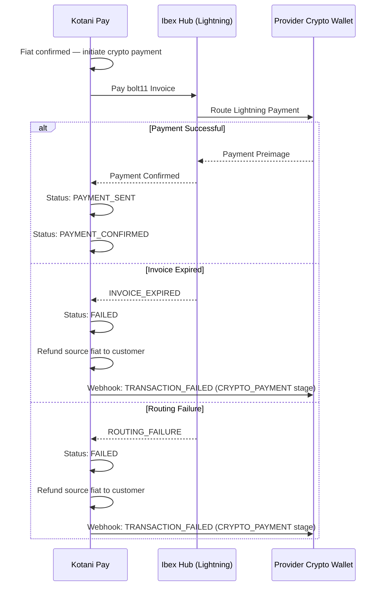
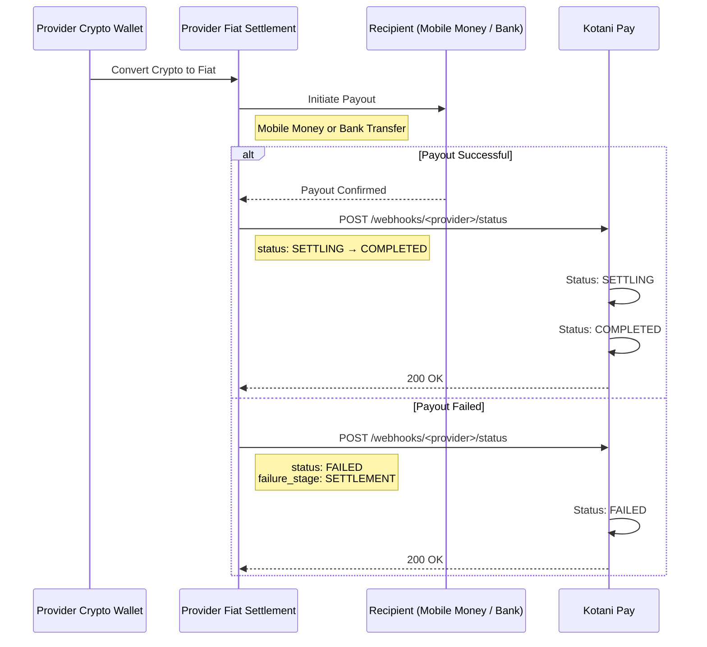
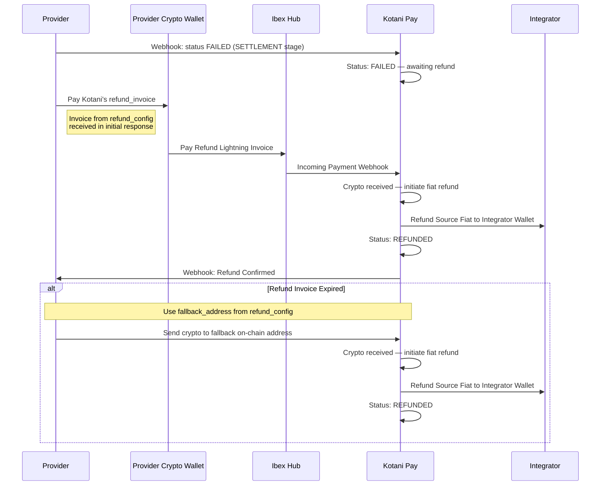
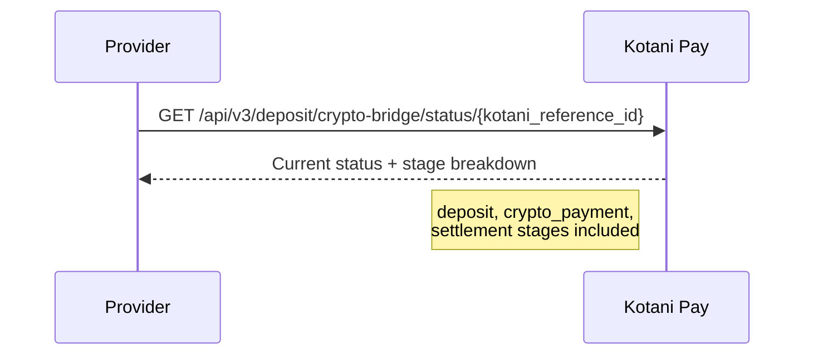

Crypto Bridge enables cross-border remittances using blockchain networks as the settlement rail. The provider initiates a transaction with a single API request that includes a pre-generated crypto payment invoice. Kotani Pay collects source fiat, pays the invoice, and the provider settles destination fiat to the recipient.

**Supported Corridors**: Kenya (KES) ↔ South Africa (ZAR) — extensible to additional countries

---

## 1. Transaction Initiation & Fiat Collection

The provider sends a single API request containing the recipient details and a pre-generated crypto invoice (e.g. Lightning bolt11). Kotani Pay initiates fiat collection from the customer simultaneously.



### Details

**Chains supported**: Lightning (BTC), Solana, Base, Ethereum
**Source currencies**: KES, ZAR — extensible
**Response includes**: `kotani_reference_id`, `refund_config` (provider **must** store this)

**Key Points**:
- Provider generates the crypto invoice before calling the API
- Kotani Pay generates and returns a `refund_config` in the initial response — the provider must store it for use if settlement fails
- Status moves to `DEPOSIT_INITIATED` immediately on acceptance

---

## 2. Crypto Payment to Provider

Once source fiat is confirmed, Kotani Pay pays the provider's crypto invoice.



### Details

**Timeline**: 30–60 seconds
**Networks**: Lightning Network (via Ibex Hub), extensible to on-chain
**Customer sees**: "Crypto transferred successfully, converting to destination currency..."

---

## 3. Provider Settlement (Crypto → Destination Fiat)

The provider converts the received crypto to destination fiat and disburses to the recipient. The provider then webhooks Kotani Pay with the outcome.



### Details

**Timeline**: SETTLING in 0–120s, COMPLETED in 120–600s
**Webhook**: Provider POSTs to Kotani Pay with `HMAC-SHA256` signature
**Recipient payment methods**: `MOBILE_MONEY`, `BANK_TRANSFER`

---

## 4. Refund Flow (If Settlement Fails)

When the provider cannot disburse destination fiat, they pay Kotani Pay's refund invoice (from `refund_config` in the initial response). Kotani Pay then refunds the source fiat to the integrator.



### Details

**Timeline**: 60–300s after settlement failure
**Primary refund**: Pay Kotani's Lightning refund invoice
**Fallback**: Send crypto to `fallback_address` (on-chain) if invoice expires

**Customer sees**: "Payment failed — Refund processing..." → "Refund completed"

---

## 5. Status Polling

The provider can poll for transaction status at any point.



---

## Transaction Statuses

| Status | Customer Display | Description |
|--------|-----------------|-------------|
| `DEPOSIT_INITIATED` | "Processing payment..." | Awaiting fiat payment confirmation |
| `DEPOSIT_CONFIRMED` | "Payment received, converting..." | Source fiat received |
| `PAYMENT_SENT` | "Crypto transferred..." | Crypto invoice paid by Kotani Pay |
| `PAYMENT_CONFIRMED` | "Converting to destination currency..." | Provider received crypto |
| `SETTLING` | "Settling payment to recipient..." | Provider converting and disbursing fiat |
| `COMPLETED` | "Payment completed successfully!" | Recipient received funds |
| `FAILED` | "Payment failed — Processing refund" | Settlement failed, refund initiated |
| `REFUNDED` | "Refund completed" | Source fiat returned to integrator |

**Total journey time**: 5–10 minutes (success) | 6–15 minutes (failure + refund)

---

## Failure Stages & Handling

| Stage | Who Detects | Failure Examples | Action |
|-------|-------------|------------------|--------|
| `DEPOSIT_COLLECTION` | Kotani Pay | Insufficient funds, customer cancelled | Error returned immediately to provider |
| `CRYPTO_PAYMENT` | Kotani Pay | Invoice expired, routing failure | Fiat refunded to customer; provider notified |
| `SETTLEMENT` | Provider | Invalid recipient, KYC failed | Provider webhooks Kotani; pays refund invoice |

---

## Webhook Security

Provider webhooks to Kotani Pay must be signed:

```
X-Kotani-Signature: HMAC-SHA256(secret, payload)
X-Kotani-Timestamp: Unix timestamp
```

Kotani Pay responds with `200 OK` and `kotani_reference_id` to acknowledge receipt.

---

## Best Practices

- **Store `refund_config`**: Save it from the initial API response — it is required if settlement fails
- **Implement webhook handler**: Set `callback_url` to receive real-time status updates
- **Validate invoice expiry**: Ensure the bolt11 invoice `expires_at` allows enough time for fiat collection (~60s minimum)
- **Handle all statuses**: Build UI states for all 8 statuses in the table above
- **Use both IDs**: Always track `kotani_reference_id` and your own `<provider>_reference_id` together

---

## Testing

Use the sandbox UI tester at `https://sandbox-api.kotanipay.com/crypto-bridge-tester` to simulate transactions in the sandbox environment.

**Test Scenarios**:

| # | Scenario | Expected Flow |
|---|----------|---------------|
| 1 | Happy path (mobile money) | `DEPOSIT_INITIATED` → `DEPOSIT_CONFIRMED` → `PAYMENT_SENT` → `PAYMENT_CONFIRMED` → `SETTLING` → `COMPLETED` |
| 2 | Happy path (bank transfer) | Same flow with bank recipient |
| 3 | Expired invoice | `DEPOSIT_CONFIRMED` → `FAILED` → Customer fiat refunded |
| 4 | Invalid recipient | `PAYMENT_CONFIRMED` → `SETTLING` → `FAILED` → `REFUNDED` |
| 5 | Delayed settlement | Extended `SETTLING` period → `COMPLETED` |
| 6 | Refund invoice expired | `FAILED` → Provider uses `fallback_address` → `REFUNDED` |
