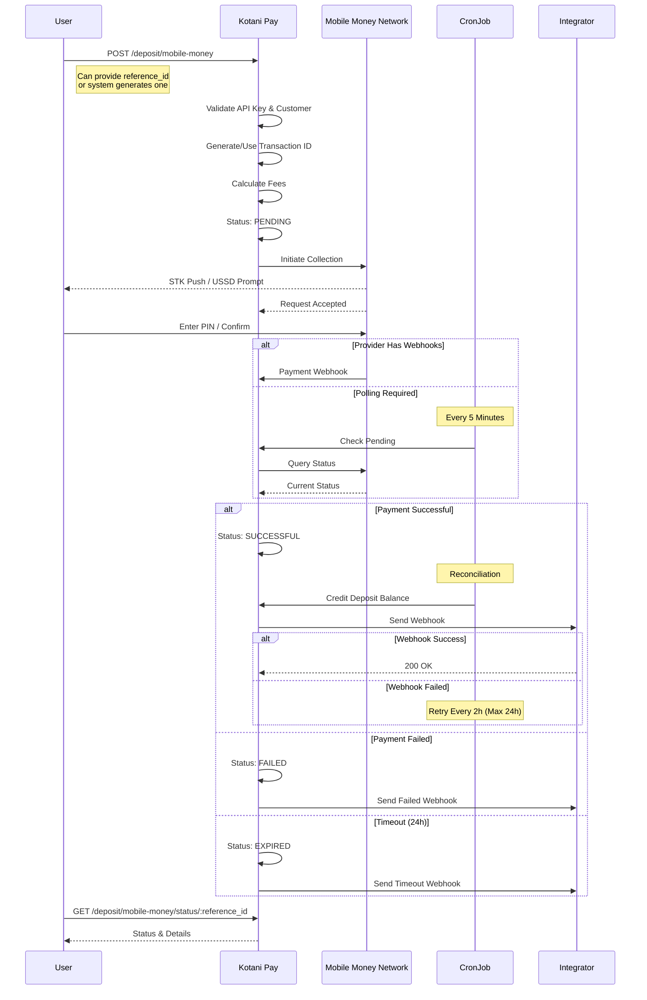
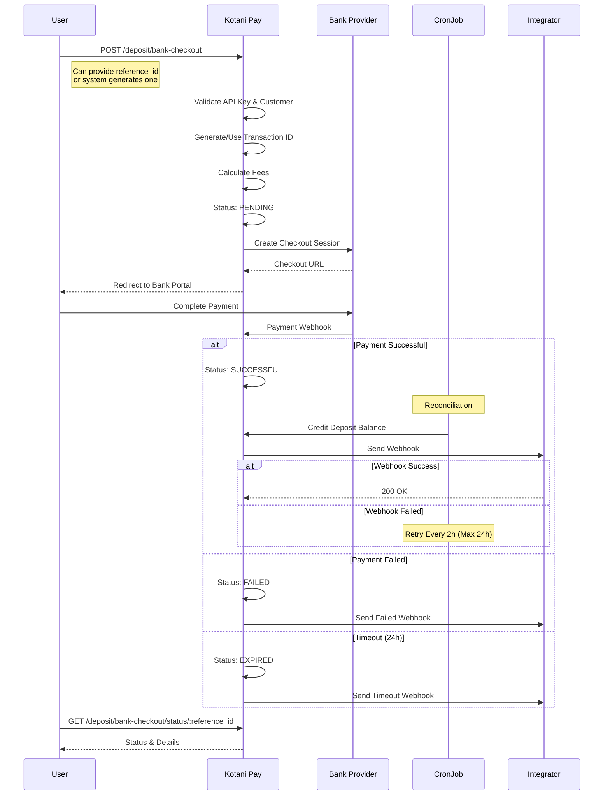
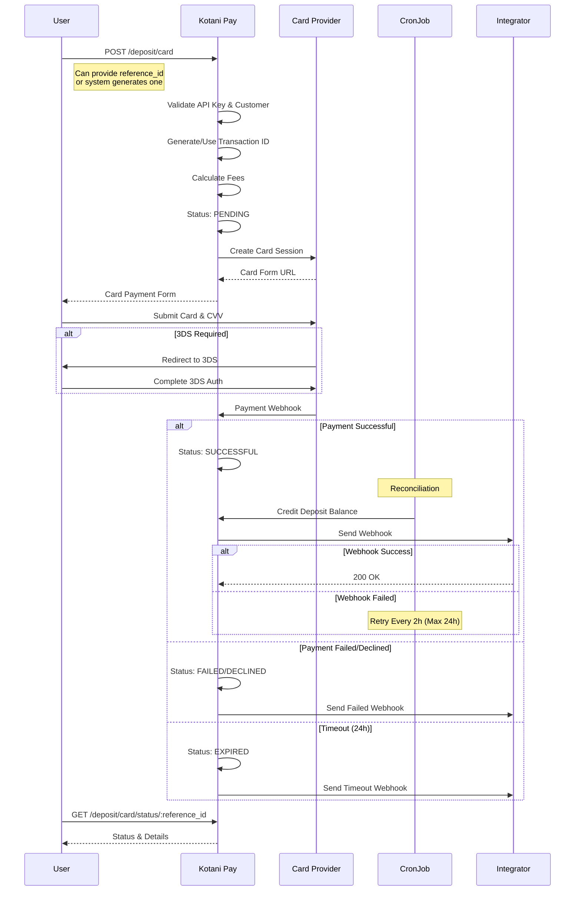

## Mobile Money Deposit Flow

Collect payments via mobile money wallets (M-PESA, MTN Money, Airtel Money, etc.)

### Flow Diagram



### Details

**Countries**: Kenya, Uganda, Tanzania, Ghana, Nigeria, Zambia, and more
**Networks**: M-PESA, MTN Money, Airtel Money, Tigo Pesa, Vodacom
**Flow**: STK Push or USSD prompt
**Speed**: Instant to few minutes

**Key Points**:
- Transaction ID can be integrator-provided or system-generated
- Funds credited after reconciliation (not immediate)
- 24-hour timeout for pending payments
- Automatic webhook retries

---

## Bank Checkout Deposit Flow

Collect payments via bank transfers with secure checkout portals.

### Flow Diagram



### Details

**Countries**: Kenya, South Africa
**Flow**: Redirect to secure bank portal
**Settlement**: Instant to 1 business day
**Banks**: Major banks in supported countries

**Key Points**:
- User redirected to secure bank portal
- Bank provider handles payment collection
- Webhook notification on completion
- Same reconciliation process as mobile money

---

## Card Deposit Flow

Collect payments via credit/debit cards with 3DS support.

### Flow Diagram



### Details

**Countries**: Multiple African countries
**Supported Cards**: Visa, Mastercard, Verve
**Security**: 3DS authentication supported
**Processing**: Instant authorization

**Key Points**:
- Card details not stored by system
- 3DS adds extra security layer
- Instant authorization from card provider
- Webhook confirms final status

---

## Transaction Statuses

| Status | Description |
|--------|-------------|
| `PENDING` | Awaiting user payment or Payment being processed|
| `INITIATED` | Payment request sent to provider |
| `IN_PROGRESS` | Payment being processed |
| `REQUIRE_REVIEW` | Payment requires manual review |
| `SUCCESSFUL` | Payment confirmed, funds will be credited |
| `FAILED` | Payment failed |
| `EXPIRED` | No confirmation within 24 hours |
| `CANCELLED` | Transaction cancelled |
| `DECLINED` | Payment declined by provider |
| `REVERSED` | Payment reversed |

---

## Common Features

### Transaction ID
- Can be **integrator-provided** via `reference_id`
- Or **system-generated** if not provided
- Must be unique per integrator

### No Rate Locking
Deposits collect fiat currency directly - no exchange rates involved.

### Automatic Reconciliation
- Successful deposits reconciled via cron job
- Funds credited to fiat wallet deposit balance
- Transaction records created for audit

### Status Monitoring
- Webhook callbacks for instant updates (when available)
- Polling every 5 minutes for pending transactions
- 24-hour timeout for unconfirmed payments

### Callback Retries
- Initial delivery via webhook
- Failed callbacks retry every 2 hours
- Maximum retry period: 24 hours

---

## Error Handling

### Insufficient Funds
```json
{
  "status": "FAILED",
  "error": "Insufficient funds in account"
}
```

### Invalid Customer
```json
{
  "status": "FAILED",
  "error": "Invalid phone number or account details"
}
```

### Card Declined
```json
{
  "status": "DECLINED",
  "error": "Card declined by issuer"
}
```

### Timeout
```json
{
  "status": "EXPIRED",
  "error": "Payment not confirmed within 24 hours"
}
```

### Duplicate Reference
```json
{
  "statusCode": 400,
  "message": "Reference already used"
}
```

---

## Best Practices

### Unique References
Always provide unique `reference_id` values to track transactions.

### Implement Webhooks
Set up webhook endpoint for real-time status updates.

### Handle All Statuses
Integration should handle all transaction statuses gracefully.