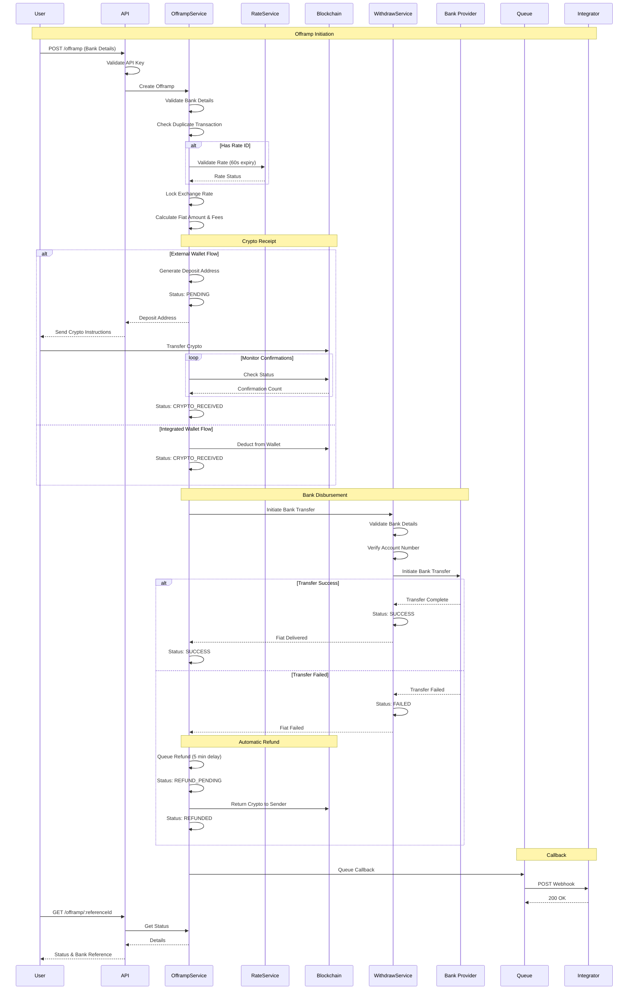

```mermaid
sequenceDiagram
    participant User
    participant API
    participant OfframpService
    participant RateService
    participant Blockchain
    participant WithdrawService
    participant Provider as Mobile Money Provider
    participant Queue
    participant Integrator

    Note over User,Integrator: Offramp Initiation

    User->>API: POST /offramp
    API->>API: Validate API Key
    API->>OfframpService: Create Offramp

    OfframpService->>OfframpService: Validate Request
    OfframpService->>OfframpService: Check Duplicate Transaction

    alt Has Rate ID
        OfframpService->>RateService: Validate Rate (60s expiry)
        alt Rate Expired
            RateService-->>OfframpService: Rate Expired
            OfframpService-->>API: 400 Error
            API-->>User: Rate Expired - Request New Rate
        else Rate Valid
            RateService-->>OfframpService: Rate Valid
        end
    end

    OfframpService->>OfframpService: Lock Exchange Rate (Crypto→Fiat)
    OfframpService->>OfframpService: Calculate Fiat Amount & Fees

    Note over OfframpService,Blockchain: Determine Crypto Flow

    alt External Wallet Flow (User sends crypto)
        OfframpService->>OfframpService: Generate Deposit Address
        OfframpService->>OfframpService: Status: PENDING
        OfframpService-->>API: Deposit Address & Details
        API-->>User: Send Crypto to Address

        User->>Blockchain: Transfer Crypto
        Blockchain->>OfframpService: Transaction Detected

        loop Monitor Transaction (3+ confirmations)
            OfframpService->>Blockchain: Check Confirmation Count
            alt Confirmed
                Blockchain-->>OfframpService: Confirmed
                OfframpService->>OfframpService: Status: CRYPTO_RECEIVED
            else Failed/Timeout
                Blockchain-->>OfframpService: Failed
                OfframpService->>OfframpService: Status: FAILED
                OfframpService-->>User: Transaction Failed
            end
        end

    else Integrated Wallet Flow (Platform wallet)
        OfframpService->>OfframpService: Verify Wallet Ownership
        OfframpService->>Blockchain: Deduct Crypto from Wallet
        OfframpService->>OfframpService: Status: CRYPTO_RECEIVED
        Note over OfframpService: Crypto already in platform custody
    end

    Note over OfframpService,Provider: Fiat Disbursement

    OfframpService->>WithdrawService: Initiate Mobile Money Withdrawal
    WithdrawService->>WithdrawService: Validate Phone & Network
    WithdrawService->>Provider: Initiate Disbursement

    alt Disbursement Success
        Provider-->>WithdrawService: Payment Sent
        WithdrawService->>WithdrawService: Status: SUCCESS
        WithdrawService-->>OfframpService: Fiat Delivered
        OfframpService->>OfframpService: Status: SUCCESS

    else Disbursement Failed
        Provider-->>WithdrawService: Payment Failed
        WithdrawService->>WithdrawService: Status: FAILED
        WithdrawService-->>OfframpService: Fiat Failed

        Note over OfframpService,Blockchain: Automatic Refund (5 min delay)

        OfframpService->>OfframpService: Queue Refund Job (5 min)
        OfframpService->>OfframpService: Status: REFUND_PENDING

        loop Refund Process (Max 3 retries)
            OfframpService->>Blockchain: Return Crypto to Sender
            alt Refund Success
                Blockchain-->>OfframpService: Crypto Returned
                OfframpService->>OfframpService: Status: REFUNDED
            else Refund Failed
                Blockchain-->>OfframpService: Refund Failed
                OfframpService->>OfframpService: Retry Count++
                alt Max Retries Reached
                    OfframpService->>OfframpService: Status: REFUND_FAILED
                    Note over OfframpService: Manual intervention required
                end
            end
        end
    end

    Note over Queue,Integrator: Callback Notification

    OfframpService->>Queue: Queue Callback Job
    Queue->>Queue: Process Callback
    Queue->>Integrator: POST Webhook (Signed)

    alt Webhook Delivered
        Integrator-->>Queue: 200 OK
        Queue->>OfframpService: Update: CALLBACK_SENT
    else Webhook Failed
        Queue->>Queue: Retry 3x with Backoff
        alt Retries Exhausted
            Queue->>OfframpService: Update: CALLBACK_FAILED
            Queue->>Queue: Schedule Cron Retry (Every 2h, Max 24h)
        end
    end

    Note over User,Integrator: Status Query

    User->>API: GET /offramp/:referenceId
    API->>OfframpService: Get Status
    OfframpService-->>API: Transaction Details
    API-->>User: Status & Transaction Details
```

# Offramp Flow (Sell Crypto)

This document shows the complete offramp flow for converting crypto to fiat and disbursing to users via different payment methods.

## Overview

Offramp allows users to convert their crypto assets to fiat currency. The flow involves:
1. Creating an offramp transaction with locked exchange rate
2. Receiving crypto payment on-chain
3. Disbursing fiat via mobile money or bank transfer
4. Automatic refund if fiat transfer fails

**Key Features**:
- Rate locking (60 seconds validity)
- Two flow modes: External wallet or Integrated wallet
- Automatic refunds on fiat transfer failure
- Multi-network crypto support (EVM, TRON, Lightning, Stellar)

---

## Mobile Money Offramp Flow

Convert crypto to fiat and disburse via mobile money networks.

### Flow Diagram



### Details

**Supported Networks**: M-PESA, Airtel Money, MTN Mobile Money, Tigo Pesa, Vodafone

**Supported Countries**: Kenya, Uganda, Tanzania, Ghana, Nigeria, Zambia

**Flow Type**:
- **External Wallet**: User sends crypto from their own wallet to generated deposit address
- **Integrated Wallet**: Platform wallet holds crypto, instant deduction

**Key Points**:
- Rate locked at transaction creation (valid for 60 seconds)
- Minimum 3 blockchain confirmations required for external wallet flow
- Automatic refund initiated 5 minutes after fiat transfer failure
- Up to 3 refund retry attempts
- Refund returns crypto to original sender address

---

## Bank Transfer Offramp Flow

Convert crypto to fiat and disburse via bank transfer.

### Flow Diagram



### Details

**Supported Countries**: Kenya, South Africa

**Required Bank Details**:
- Account holder name
- Account number
- Bank code
- Phone number
- Address
- Country

**Processing Time**:
- Instant to 24 hours depending on bank processing
- Faster for major banks
- May be delayed for inter-bank transfers

**Key Points**:
- Bank account verification before processing
- Reference number provided for tracking
- Automatic refund on failed bank transfer
- Bank transfers are irreversible once confirmed

---

## Transaction Statuses

| Status | Description |
|--------|-------------|
| `PENDING` | Awaiting crypto payment |
| `CRYPTO_RECEIVED` | Crypto confirmed, preparing fiat transfer |
| `PROCESSING` | Fiat disbursement in progress |
| `SUCCESS` | Fiat delivered successfully |
| `FAILED` | Transaction failed |
| `REFUND_PENDING` | Refund queued (fiat failed, returning crypto) |
| `REFUNDED` | Crypto returned to sender |
| `REFUND_FAILED` | Refund attempts exhausted, manual intervention needed |
| `CANCELLED` | Transaction cancelled by user |
| `TIMEOUT` | Crypto not received within timeout period |
| `CALLBACK_SENT` | Integrator notified |

---

## Crypto Networks Supported

### EVM Chains
- **Networks**: Ethereum, Polygon, Arbitrum, Base, Optimism, Celo
- **Tokens**: USDT, USDC, DAI, USDK
- **Confirmations**: 3 blocks required
- **Refund**: Returns to sender address automatically

### TRON
- **Tokens**: USDT (TRC20)
- **Confirmations**: Verified via TronGrid
- **Refund**: Returns to sender address

### Lightning Network
- **Use Case**: Fast Bitcoin offramps
- **Payment**: Lightning invoice
- **Refund**: Lightning payment reversed

### Stellar
- **Tokens**: USDC, other Stellar assets
- **Confirmations**: Near-instant
- **Refund**: Returns to sender address

---

## Key Features

### Rate Locking
- Exchange rate locked at transaction creation
- Valid for 60 seconds
- Must request new rate if expired
- Protects from volatility during crypto transfer

### Automatic Refunds
- Triggered 5 minutes after fiat transfer failure
- Up to 3 retry attempts
- Returns crypto to original sender address
- Status tracking via `/offramp/refund-status/:referenceId`

### Flexible Wallet Options
- **External Wallet**: User controls private keys, sends from any wallet
- **Integrated Wallet**: Platform-managed wallet for instant processing
- Automatic detection of wallet type

### Transaction Monitoring
- Real-time blockchain confirmation tracking
- Webhook notifications for all status changes
- Query status anytime via API
- Block explorer links provided

---

## Error Handling

### Rate Expired
```json
{
  "statusCode": 400,
  "message": "Rate expired. Rates are valid for 60 seconds. Please request a new rate.",
  "details": {
    "rateId": "rate_123456",
    "expiresAt": "2024-01-15T10:01:00Z",
    "currentTime": "2024-01-15T10:02:00Z"
  }
}
```

### Insufficient Crypto Amount
```json
{
  "statusCode": 400,
  "message": "Insufficient crypto amount",
  "details": {
    "required": 10.5,
    "provided": 10.0,
    "currency": "USDT",
    "network": "Polygon"
  }
}
```

### Invalid Bank Details
```json
{
  "statusCode": 400,
  "message": "Invalid bank account details",
  "details": {
    "accountNumber": "Invalid format",
    "bankCode": "Bank not found"
  }
}
```

### Fiat Transfer Failed (Auto-Refund)
```json
{
  "status": "REFUND_PENDING",
  "message": "Fiat transfer failed. Crypto refund will be processed in 5 minutes.",
  "refund": {
    "cryptoAmount": 10.5,
    "currency": "USDT",
    "network": "Polygon",
    "destination": "0x742d35Cc6634C0532925a3b844Bc9e7595f0bEb",
    "estimatedTime": "2024-01-15T10:15:00Z"
  }
}
```

### Duplicate Transaction
```json
{
  "statusCode": 400,
  "message": "Transaction In Progress",
  "details": {
    "existingReferenceId": "offramp_123456",
    "status": "CRYPTO_RECEIVED"
  }
}
```

---

## Offramp Fees

Fee structure varies by network and amount:

```json
{
  "cryptoAmount": 10.5,
  "cryptoCurrency": "USDT",
  "network": "Polygon",
  "fiatAmount": 1200000,
  "fiatCurrency": "UGX",
  "fees": {
    "exchangeFee": 15000,
    "networkFee": 5000,
    "disbursementFee": 3000,
    "totalFee": 23000
  },
  "netFiatAmount": 1177000,
  "exchangeRate": 0.00000875
}
```

---

## Best Practices

### Pre-Check Rates
```javascript
// Get current rate before creating offramp
const rate = await fetch('/rates/offramp-rate', {
  method: 'POST',
  body: JSON.stringify({
    cryptoAmount: 10.5,
    cryptoCurrency: 'USDT',
    fiatCurrency: 'KES',
    network: 'Polygon'
  })
});

// Use rate ID when creating offramp
const offramp = await fetch('/offramp', {
  method: 'POST',
  body: JSON.stringify({
    rateId: rate.data.rateId,
    // ... other fields
  })
});
```

### Validate Crypto Addresses
- Ensure sender address format matches network (EVM: 0x..., TRON: T...)
- Test with small amounts first in production
- Verify address ownership if using external wallet

### Handle Callbacks
- Implement webhook endpoint for real-time updates
- Verify HMAC signature on all webhooks
- Handle all status transitions including refund states
- Store transaction hash for audit trail

### Monitor Refunds
- Check refund status via `/offramp/refund-status/:referenceId`
- Automatic retry logic handles most failures
- Contact support if refund status is `REFUND_FAILED`

### Bank Transfers
- Verify bank account details before submission
- Bank code must match country's banking system
- Provide accurate phone number for verification
- Processing times vary by bank and country

---

## Testing

Sandbox mode test data:

**Test Crypto**:
- Polygon (testnet): Use Mumbai testnet USDT
- Test sender addresses provided in sandbox
- Transaction confirmations simulated (instant in test)

**Test Mobile Money**:
- Phone: `+254700000000` (Kenya test number)
- Network: `MPESA`
- All test transactions simulate success

**Test Bank Transfer**:
- Account: `1234567890`
- Bank Code: `01` (Test Bank)
- Country: `Kenya`

**Test Scenarios**:
- Crypto amounts ending in `.00` trigger success
- Crypto amounts ending in `.99` trigger fiat failure + refund
- Crypto amounts ending in `.88` trigger timeout
