**Key Features**:
- Rate locking (60 seconds validity)
- Two flow modes: External wallet or Integrated wallet
- Automatic refunds on fiat transfer failure
- Multi-network crypto support (EVM, TRON, Lightning, Stellar)

---

## 1. Transaction Initiation & Rate Locking

```mermaid
sequenceDiagram
    participant User
    participant Kotani Pay

    User->>Kotani Pay: POST /offramp
    Kotani Pay->>Kotani Pay: Validate API Key
    Kotani Pay->>Kotani Pay: Validate Request
    Kotani Pay->>Kotani Pay: Check Duplicate

    alt Has Rate ID
        Kotani Pay->>Kotani Pay: Validate Rate (60s expiry)
        alt Rate Expired
            Kotani Pay-->>User: 400 Rate Expired
        end
    end

    Kotani Pay->>Kotani Pay: Lock Exchange Rate (Crypto→Fiat)
    Kotani Pay->>Kotani Pay: Calculate Fiat Amount & Fees
```



---

## 2. Crypto Receipt

### External Wallet Flow

User sends crypto from their own wallet.


### Integrated Wallet Flow

Platform wallet holds crypto, instant processing.


---

## 3. Fiat Disbursement

### Mobile Money Disbursement


**Available Countries**: All supported countries
**Networks**: M-PESA, Airtel Money, MTN Mobile Money, Orange Money

### Bank Transfer Disbursement


**Available Countries**: All supported countries
**Processing Time**: Instant to 24 hours

---

## 4. Automatic Refund (On Fiat Failure)


---

## 5. Webhook Notification


---

## Transaction Statuses

| Status | Description |
|--------|-------------|
| `PENDING` | Awaiting crypto payment |
| `CRYPTO_RECEIVED` | Crypto confirmed, preparing fiat transfer |
| `PROCESSING` | Fiat disbursement in progress |
| `SUCCESS` | Fiat delivered successfully |
| `FAILED` | Transaction failed |
| `REFUND_PENDING` | Refund queued (fiat failed, returning crypto) |
| `REFUNDED` | Crypto returned to sender |
| `REFUND_FAILED` | Refund attempts exhausted, manual intervention needed |
| `TIMEOUT` | Crypto not received within timeout period |

---

## Crypto Networks Supported

### EVM Chains
- **Networks**: Ethereum, Polygon, Arbitrum, Base, Optimism, Celo
- **Tokens**: USDT, USDC, DAI
- **Confirmations**: 3 blocks required

### TRON
- **Tokens**: USDT (TRC20)
- **Confirmations**: Verified via TronGrid

### Lightning Network
- **Use Case**: Fast Bitcoin offramps
- **Payment**: Lightning invoice

### Stellar
- **Tokens**: USDC, other Stellar assets
- **Confirmations**: Near-instant

---

## Key Features

### Rate Locking
- Exchange rate locked at transaction creation
- Valid for 60 seconds
- Must request new rate if expired

### Automatic Refunds
- Triggered 5 minutes after fiat transfer failure
- Up to 3 retry attempts
- Returns crypto to original sender address
- Track via `/offramp/refund-status/:referenceId`

### Flexible Wallet Options
- **External Wallet**: User controls private keys
- **Integrated Wallet**: Platform-managed for instant processing

---

## Error Handling

### Rate Expired
```json
{
  "statusCode": 400,
  "message": "Rate expired. Rates are valid for 60 seconds."
}
```

### Insufficient Crypto Amount
```json
{
  "statusCode": 400,
  "message": "Insufficient crypto amount"
}
```

### Fiat Transfer Failed (Auto-Refund)
```json
{
  "status": "REFUND_PENDING",
  "message": "Fiat transfer failed. Crypto refund will be processed in 5 minutes.",
  "refund": {
    "cryptoAmount": 10.5,
    "currency": "USDT",
    "network": "Polygon"
  }
}
```

---

## Best Practices

- **Pre-Check Rates**: Use `/rates/offramp-rate` before creating transaction
- **Validate Addresses**: Ensure sender address format matches network
- **Handle Callbacks**: Implement webhook endpoint with HMAC verification
- **Monitor Refunds**: Check refund status via `/offramp/refund-status/:referenceId`
- **Bank Transfers**: Verify bank account details before submission

---

## Testing

Use sandbox mode with test credentials provided in sandbox documentation.

**Test Scenarios**:
- Crypto amounts ending in `.00` trigger success
- Crypto amounts ending in `.99` trigger fiat failure + refund
- Crypto amounts ending in `.88` trigger timeout
