# Onramp Flow (Buy Crypto)

This diagram shows the complete onramp flow for converting fiat to crypto, including payment collection and crypto delivery.

## Flow Diagram

```mermaid
sequenceDiagram
    participant User
    participant API
    participant OnrampService
    participant DepositService
    participant Provider as Payment Provider
    participant Blockchain
    participant CryptoWallet
    participant Queue
    participant Integrator

    Note over User,Integrator: Onramp Initiation

    User->>API: POST /onramp/crypto
    API->>API: Validate API Key
    API->>API: Validate Onramp Request
    API->>OnrampService: Create Onramp Transaction

    OnrampService->>OnrampService: Generate Transaction ID
    OnrampService->>OnrampService: Lock Exchange Rate (Fiat→Crypto)
    OnrampService->>OnrampService: Calculate Crypto Amount & Fees

    alt Has Crypto Wallet
        OnrampService->>OnrampService: Validate Wallet Address
        OnrampService->>OnrampService: Mode: CRYPTO_DELIVERY
    else No Crypto Wallet
        OnrampService->>OnrampService: Mode: FIAT_WALLET_CREDIT
        Note over OnrampService: Will credit fiat wallet instead
    end

    Note over User,Provider: Fiat Payment Collection

    OnrampService->>DepositService: Initiate Fiat Deposit

    alt Mobile Money Payment
        DepositService->>Provider: Initiate Collection
        Provider-->>DepositService: STK Push Sent
        DepositService-->>OnrampService: Payment Pending
        OnrampService->>OnrampService: Status: PENDING_PROVIDER
        OnrampService-->>API: Transaction Details
        API-->>User: STK Push / USSD Instructions

        User->>Provider: Enter PIN / Confirm Payment
        Provider->>DepositService: Payment Callback (Success/Failed)

    else Bank Checkout
        DepositService->>Provider: Create Checkout Session
        Provider-->>DepositService: Checkout URL
        DepositService-->>OnrampService: Checkout URL
        OnrampService->>OnrampService: Status: PENDING
        OnrampService-->>API: Checkout URL
        API-->>User: Redirect to Bank

        User->>Provider: Complete Bank Payment
        Provider->>DepositService: Payment Webhook

    else Fiat Wallet Deduction
        OnrampService->>CryptoWallet: Check Fiat Balance
        alt Insufficient Balance
            CryptoWallet-->>OnrampService: Insufficient Funds
            OnrampService-->>API: Error
            API-->>User: 400 Error
        else Sufficient Balance
            CryptoWallet-->>OnrampService: Balance OK
            OnrampService->>CryptoWallet: Reserve Fiat Amount
            OnrampService->>OnrampService: Status: PENDING
        end
    end

    Note over DepositService,Blockchain: Payment Confirmed - Crypto Delivery

    DepositService->>OnrampService: Payment Confirmed
    OnrampService->>OnrampService: Update Rate Lock
    OnrampService->>OnrampService: Status: CRYPTO_PENDING

    alt Mode: CRYPTO_DELIVERY
        OnrampService->>OnrampService: Validate Destination

        alt Lightning Network
            OnrampService->>OnrampService: Validate Lightning Invoice
            OnrampService->>Blockchain: Pay Lightning Invoice
            Blockchain-->>OnrampService: Payment Preimage
            OnrampService->>OnrampService: Verify Payment
            alt Payment Success
                OnrampService->>OnrampService: Status: SUCCESS
                OnrampService->>CryptoWallet: Deduct Fiat (if wallet source)
            else Payment Failed
                OnrampService->>OnrampService: Status: FAILED
                OnrampService->>CryptoWallet: Credit Fiat Wallet (Refund)
                Note over OnrampService: Crypto failed, fiat returned
            end

        else EVM Chain (Ethereum/Polygon/Arbitrum/Base)
            OnrampService->>OnrampService: Validate EVM Address
            OnrampService->>Blockchain: Initiate Token Transfer
            Blockchain-->>OnrampService: Transaction Hash

            OnrampService->>OnrampService: Status: PROCESSING
            loop Monitor Transaction (Max 3 retries)
                OnrampService->>Blockchain: Check Confirmation Status
                Blockchain-->>OnrampService: Confirmation Count
                alt Confirmed (3+ blocks)
                    OnrampService->>OnrampService: Status: SUCCESS
                    OnrampService->>CryptoWallet: Deduct Fiat (if wallet source)
                else Failed / Reverted
                    OnrampService->>OnrampService: Retry Transaction
                    alt Max Retries Reached
                        OnrampService->>OnrampService: Status: FAILED
                        OnrampService->>CryptoWallet: Credit Fiat Wallet (Refund)
                    end
                end
            end

        else TRON Network
            OnrampService->>OnrampService: Validate TRON Address
            OnrampService->>Blockchain: Initiate TRC20 Transfer
            Blockchain-->>OnrampService: Transaction Hash

            OnrampService->>OnrampService: Status: PROCESSING
            loop Monitor Transaction
                OnrampService->>Blockchain: Check Confirmation (TronGrid)
                Blockchain-->>OnrampService: Confirmation Status
                alt Confirmed
                    OnrampService->>OnrampService: Status: SUCCESS
                    OnrampService->>CryptoWallet: Deduct Fiat (if wallet source)
                else Failed
                    OnrampService->>OnrampService: Status: FAILED
                    OnrampService->>CryptoWallet: Credit Fiat Wallet (Refund)
                end
            end
        end

    else Mode: FIAT_WALLET_CREDIT
        Note over OnrampService: No crypto wallet - credit fiat instead
        OnrampService->>CryptoWallet: Credit Fiat Wallet
        OnrampService->>OnrampService: Status: SUCCESS
        Note over OnrampService: Fiat wallet credited at crypto rate
    end

    Note over Queue,Integrator: Callback & Notification

    OnrampService->>Queue: Queue Callback Job
    Queue->>Queue: Process Callback
    Queue->>Integrator: POST Webhook (Signed)

    alt Webhook Delivered
        Integrator-->>Queue: 200 OK
        Queue->>OnrampService: Update: CALLBACK_SENT
    else Webhook Failed
        Queue->>Queue: Retry 3x with Backoff
        alt Retries Exhausted
            Queue->>OnrampService: Update: CALLBACK_FAILED
            Queue->>Queue: Schedule Cron Retry (Every 2h, Max 24h)
        end
    end

    Note over User,Integrator: Status Query

    User->>API: GET /onramp/:id/status
    API->>OnrampService: Get Status
    OnrampService-->>API: Transaction Details
    API-->>User: Status & Transaction Hash
```



## Payment Methods

### Mobile Money
- **Countries**: Kenya, Uganda, Tanzania, Ghana, Nigeria
- **Flow**: STK Push or USSD collection
- **Integration**: Multiple mobile money providers supported

### Bank Checkout
- **Countries**: South Africa, Nigeria, Kenya
- **Flow**: Redirect to secure bank portal
- **Integration**: Multiple bank payment providers supported

### Fiat Wallet
- **Source**: Integrator's fiat wallet balance
- **Flow**: Direct deduction (instant)
- **Use Case**: Fast onramp for users with existing balance

## Crypto Networks Supported

### Lightning Network
- **Use Case**: Fast, low-fee Bitcoin payments
- **Delivery**: Instant via Lightning invoice
- **Integration**: Lightning Network protocol support

### EVM Chains
- **Networks**: Ethereum, Polygon, Arbitrum, Base, Optimism
- **Tokens**: USDT, USDC, DAI, USDK
- **Confirmations**: 3 blocks required
- **Gas**: Handled by platform

### TRON
- **Tokens**: USDT (TRC20)
- **Confirmations**: Instant (TronGrid webhooks)
- **Gas**: Handled by platform

## Transaction Statuses

| Status | Description |
|--------|-------------|
| `PENDING` | Awaiting fiat payment |
| `PENDING_PROVIDER` | Payment initiated with provider |
| `CRYPTO_PENDING` | Fiat confirmed, crypto transfer in progress |
| `PROCESSING` | Blockchain transaction submitted |
| `SUCCESS` | Crypto delivered successfully |
| `FAILED` | Transaction failed (fiat refunded to wallet) |
| `TIMEOUT` | Payment not confirmed within 24 hours |
| `CALLBACK_SENT` | Integrator notified |

## Key Features

### Rate Locking
- Exchange rate locked at transaction creation
- Protects user from price volatility during payment
- Rate valid for 30 minutes
- Auto-refreshed upon payment confirmation

### Flexible Delivery
- **Has Crypto Wallet**: Crypto delivered to user's address
- **No Crypto Wallet**: Fiat credited at crypto rate (can onramp later)
- Automatic fallback ensures funds never lost

### Safety Mechanisms
- Failed crypto transfers automatically refund to fiat wallet
- Up to 3 retry attempts for blockchain transactions
- All funds accounted for at every step
- Balance never lost

### Multi-Chain Support
- Single API for all networks
- Automatic gas fee handling
- Optimal routing based on amount and network fees

## Error Handling

### Insufficient Fiat Wallet Balance
```json
{
  "statusCode": 400,
  "message": "Insufficient balance in fiat wallet",
  "details": {
    "availableBalance": 5000,
    "requiredAmount": 10000,
    "currency": "KES"
  }
}
```

### Invalid Crypto Address
```json
{
  "statusCode": 400,
  "message": "Invalid crypto address",
  "details": {
    "network": "Polygon",
    "providedAddress": "0xinvalid",
    "error": "Invalid EVM address format"
  }
}
```

### Crypto Transfer Failed (Auto-Refund)
```json
{
  "status": "FAILED",
  "message": "Crypto transfer failed after 3 attempts",
  "refund": {
    "amount": 10000,
    "currency": "KES",
    "destination": "Fiat Wallet",
    "status": "REFUNDED"
  }
}
```

### Rate Expired
```json
{
  "statusCode": 400,
  "message": "Exchange rate expired",
  "details": {
    "lockedAt": "2024-01-15T10:00:00Z",
    "expiresAt": "2024-01-15T10:30:00Z",
    "currentTime": "2024-01-15T10:31:00Z"
  }
}
```

## Onramp Fees

Fee structure:
```json
{
  "fiatAmount": 10000,
  "fiatCurrency": "KES",
  "cryptoAmount": 8.5,
  "cryptoCurrency": "USDT",
  "network": "Polygon",
  "fees": {
    "paymentFee": 100,
    "exchangeFee": 150,
    "networkFee": 50,
    "totalFee": 300
  },
  "netCryptoAmount": 8.2,
  "exchangeRate": 118.50
}
```

## Best Practices

### Pre-Check Rates
```javascript
// Get current rate before creating onramp
const rate = await fetch('/rates/onramp-rate', {
  method: 'POST',
  body: JSON.stringify({
    fiatAmount: 10000,
    fiatCurrency: 'KES',
    cryptoCurrency: 'USDT',
    network: 'Polygon'
  })
});
```

### Validate Addresses
- Use blockchain explorer to verify address format
- Test with small amounts first in production
- Lightning: Validate invoice expiry and amount

### Handle Callbacks
- Implement webhook endpoint for real-time updates
- Verify HMAC signature on all webhooks
- Handle all status transitions (success, failed, timeout)

### Monitor Status
- Poll status endpoint after initiation
- Display blockchain transaction hash to users
- Provide block explorer links for transparency

## Testing

Sandbox mode test data:
- **Test Fiat**: Use deposit test credentials
- **Test Crypto Addresses**:
  - Polygon: `0x742d35Cc6634C0532925a3b844Bc9e7595f0bEb`
  - TRON: `TTest1111111111111111111111111111111`
  - Lightning: Generate from sandbox environment
- **Test Amounts**: Amounts ending in 00 trigger success scenarios
