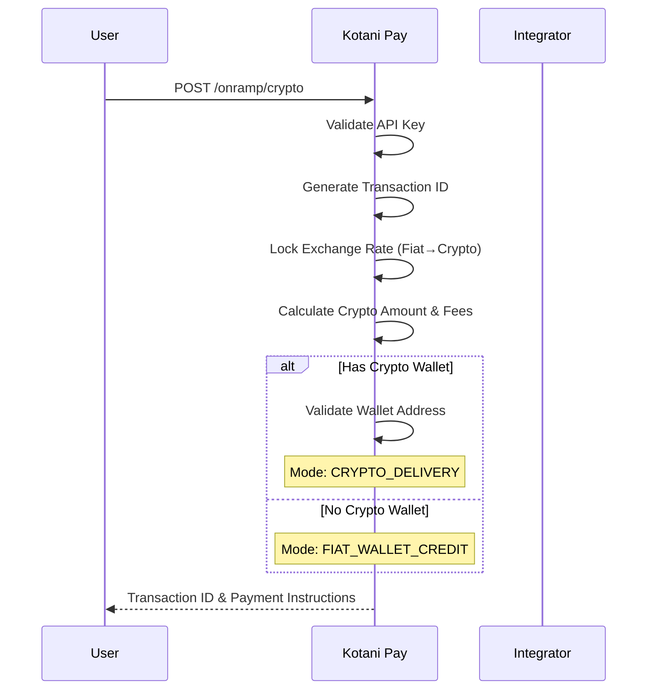
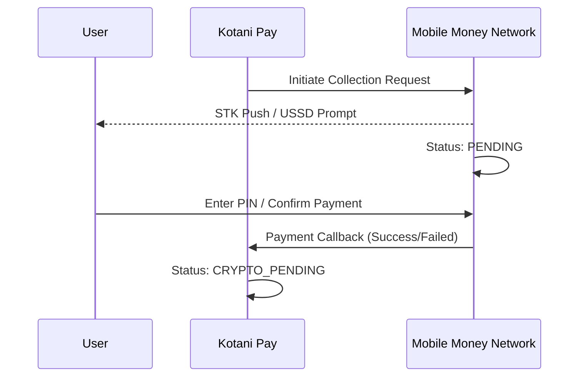
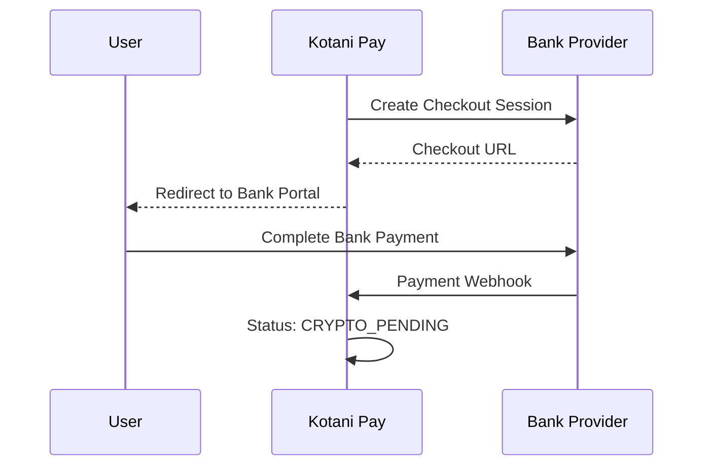
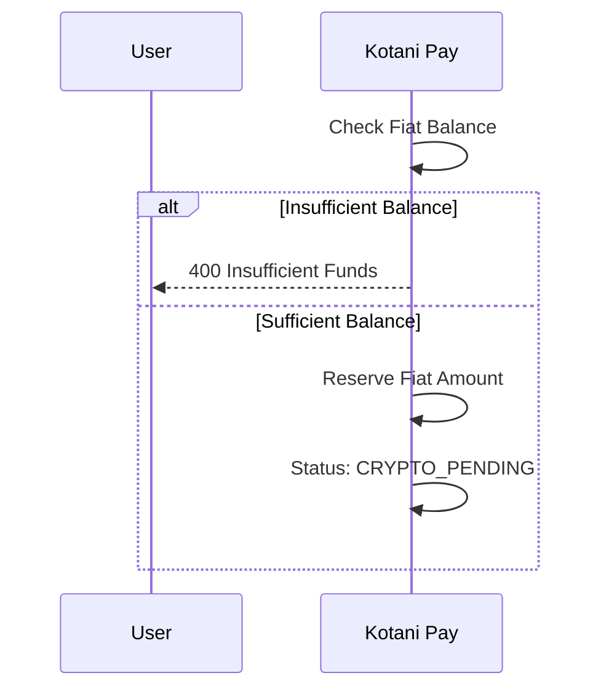
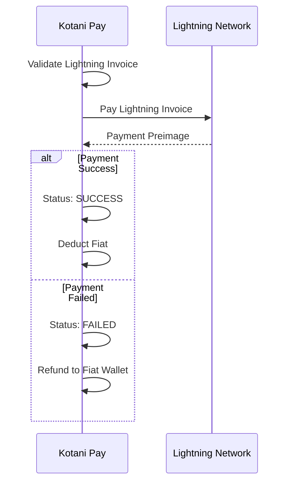
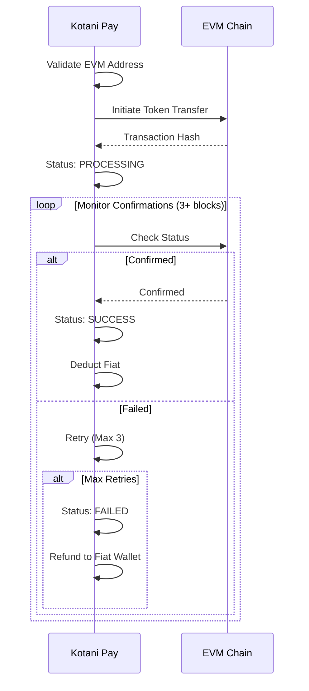
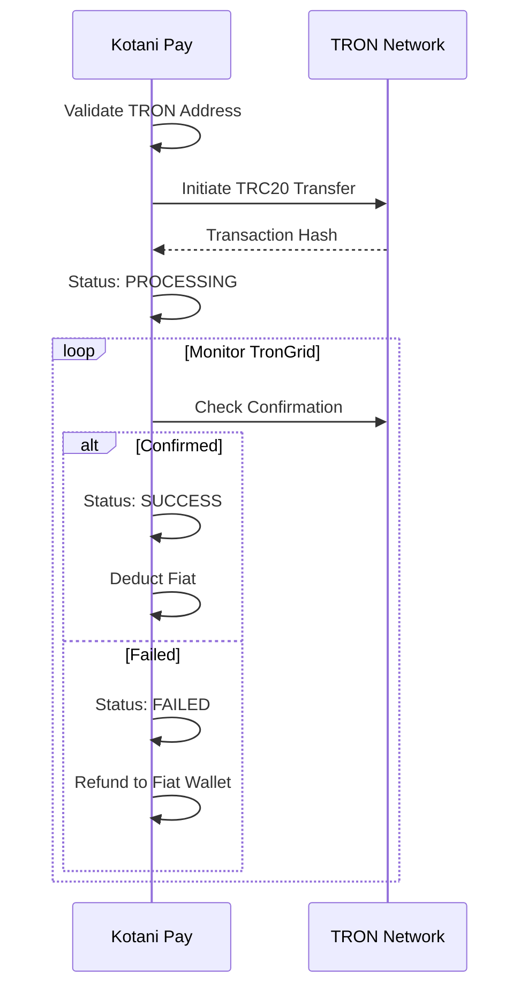
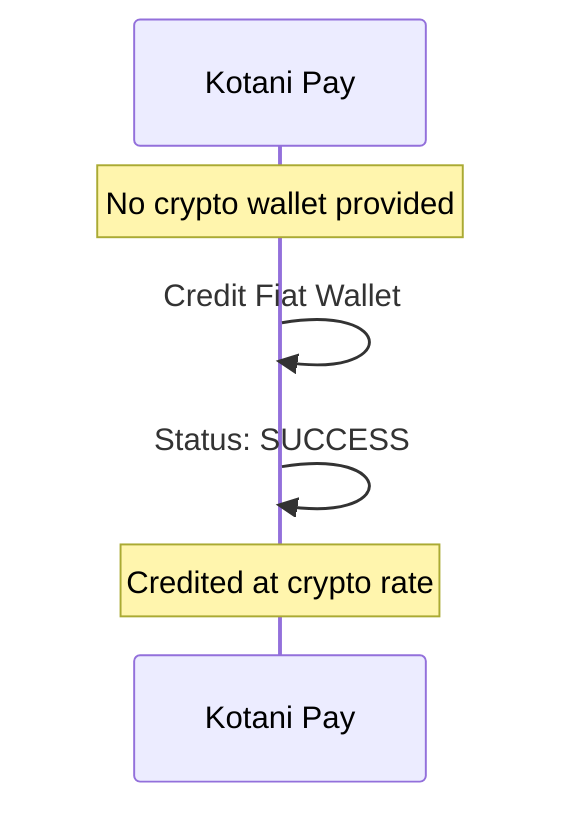
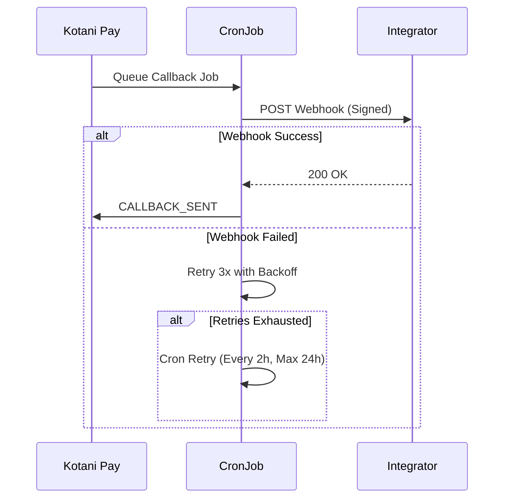

**Available Countries**: South Africa, Ivory Coast, Benin, Congo B, Gabon, Burkina Faso, Malawi, Mozambique, Senegal, Sierra Leone, Zambia

---

## 1. Transaction Initiation

Creating an onramp transaction with rate locking.



---

## 2. Fiat Payment Collection

### Mobile Money Payment



**Available Countries**: All supported countries
**Networks**: M-PESA, MTN Money, Airtel Money, Orange Money

### Bank Checkout Payment



### Fiat Wallet Deduction



---

## 3. Crypto Delivery

### Lightning Network Delivery



### EVM Chain Delivery



**Supported Networks**: Ethereum, Polygon, Arbitrum, Base, Optimism
**Tokens**: USDT, USDC, DAI

### TRON Network Delivery



**Tokens**: USDT (TRC20)

### Fiat Wallet Credit (No Crypto Wallet)



---

## 4. Webhook Notification



---

## Transaction Statuses

| Status | Description |
|--------|-------------|
| `PENDING` | Awaiting fiat payment |
| `PENDING_PROVIDER` | Payment initiated with provider |
| `CRYPTO_PENDING` | Fiat confirmed, crypto transfer in progress |
| `PROCESSING` | Blockchain transaction submitted |
| `SUCCESS` | Crypto delivered successfully |
| `FAILED` | Transaction failed (fiat refunded to wallet) |
| `TIMEOUT` | Payment not confirmed within 24 hours |

---

## Key Features

### Rate Locking
- Exchange rate locked at transaction creation
- Valid for 30 minutes
- Auto-refreshed upon payment confirmation

### Flexible Delivery
- **Has Crypto Wallet**: Crypto delivered to user's address
- **No Crypto Wallet**: Fiat credited at crypto rate

### Safety Mechanisms
- Failed crypto transfers automatically refund to fiat wallet
- Up to 3 retry attempts for blockchain transactions
- Balance never lost

---

## Error Handling

### Insufficient Fiat Wallet Balance
```json
{
  "statusCode": 400,
  "message": "Insufficient balance in fiat wallet"
}
```

### Invalid Crypto Address
```json
{
  "statusCode": 400,
  "message": "Invalid crypto address"
}
```

### Crypto Transfer Failed (Auto-Refund)
```json
{
  "status": "FAILED",
  "message": "Crypto transfer failed after 3 attempts",
  "refund": {
    "amount": 10000,
    "currency": "KES",
    "destination": "Fiat Wallet",
    "status": "REFUNDED"
  }
}
```

---

## Best Practices

- **Pre-Check Rates**: Use `/rates/onramp-rate` before creating transaction
- **Validate Addresses**: Verify address format matches network
- **Handle Callbacks**: Implement webhook endpoint with HMAC verification
- **Monitor Status**: Poll status endpoint and display transaction hash to users

---

## Testing

Use sandbox mode with test credentials provided in sandbox documentation.
