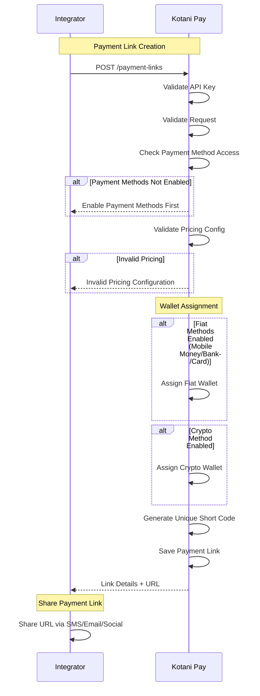
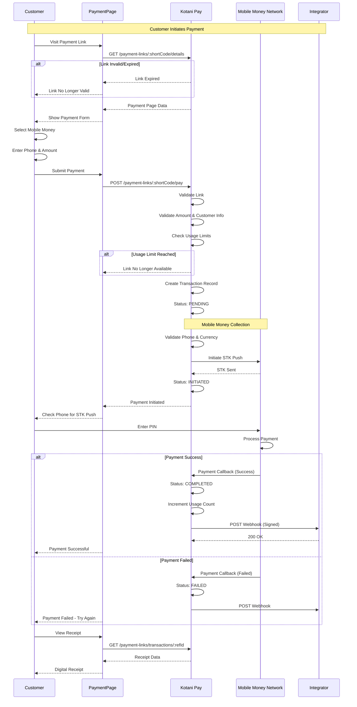
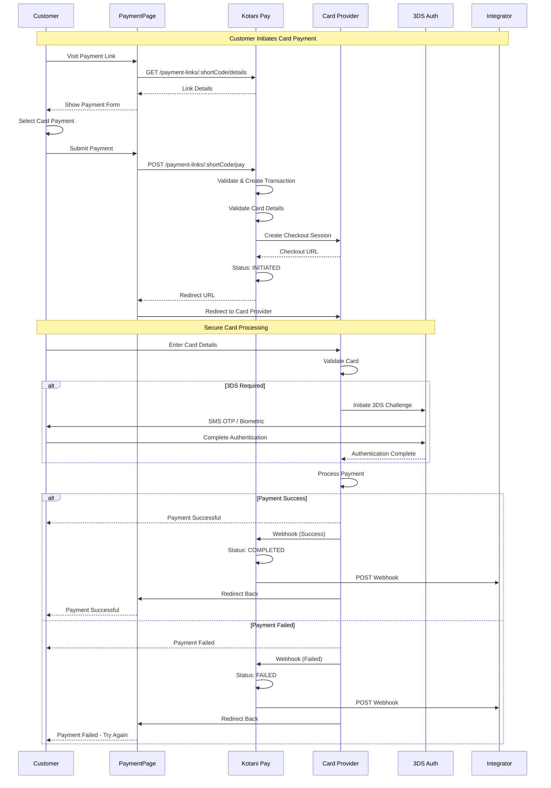
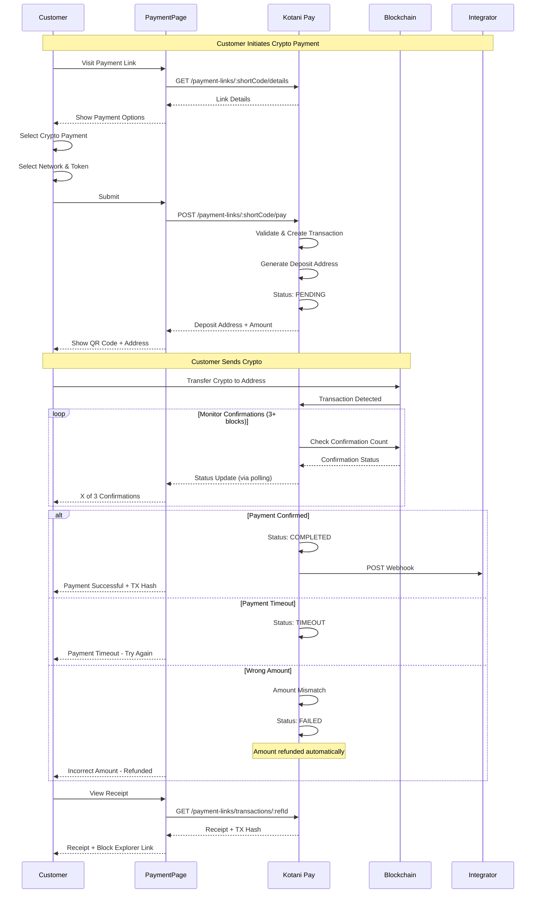
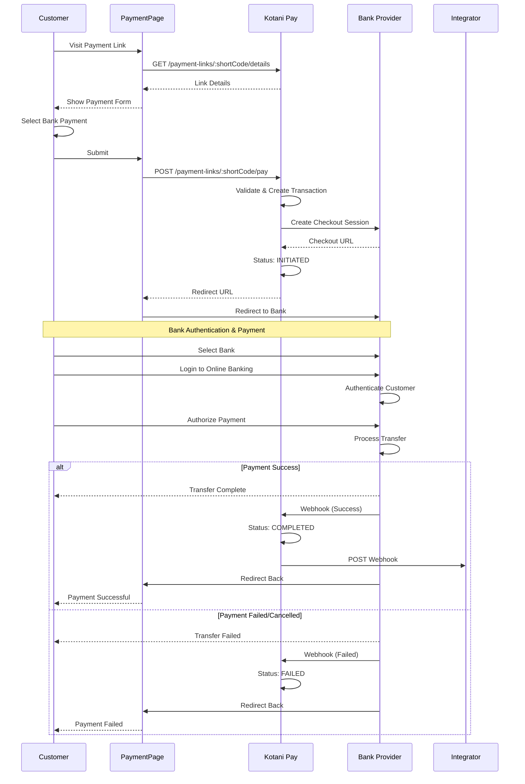

## Overview

Payment links provide a hosted payment page that accepts:
- Mobile money payments
- Bank transfers
- Card payments
- Crypto payments

**Key Features**:
- Single link, multiple payment methods
- Flexible pricing (fixed, variable, packages)
- Customer info collection
- Branded payment pages
- Usage limits and expiration
- Automatic wallet routing
- Webhook notifications

---

## Payment Link Creation Flow

Create and configure a payment link with pricing, payment methods, and branding.

### Flow Diagram



### Details

**Pricing Types**:
- **FIXED**: Set amount (e.g., $10.00)
- **VARIABLE**: Min/max range (e.g., $5-$100)
- **CUSTOMER_CHOICE**: Customer enters any amount within limits
- **PACKAGE**: Predefined packages (e.g., Basic $10, Pro $25, Enterprise $100)

**Payment Methods**: Configure which methods to enable:
- `MOBILE_MONEY`: Mobile money payments
- `BANK`: Bank transfers
- `CARD`: Card payments
- `CRYPTO`: Cryptocurrency payments

**Usage Types**:
- **SINGLE_USE**: Link expires after one successful payment
- **MULTIPLE_USE**: Can be used up to `maxUses` times
- **UNLIMITED**: No usage limit

**Customer Info Collection**: Configure what to collect:
- `REQUIRED`: Must be provided
- `OPTIONAL`: Can be skipped
- `HIDDEN`: Not collected

**Key Points**:
- Short code generated automatically (e.g., `abc123`)
- Link URL: `https://pay.kotanipay.com/l/{shortCode}`
- Wallets assigned based on enabled payment methods
- Multi-currency support per payment method
- Branding customization (logo, colors)
- Optional expiration date
- Callback URL for webhooks

---

## Mobile Money Payment Flow

Customer pays via mobile money through a payment link.

### Flow Diagram



### Details

**Supported Networks**: M-PESA, Airtel Money, MTN Mobile Money, Tigo Pesa, Vodafone

**Customer Flow**:
1. Customer visits payment link
2. Selects mobile money payment method
3. Enters phone number
4. Enters amount (if variable pricing)
5. Provides required customer info
6. Submits payment
7. Receives STK push on phone
8. Enters PIN to authorize
9. Receives confirmation on payment page

**Key Points**:
- Real-time validation of phone numbers
- Currency auto-detected from phone number
- Automatic network detection (M-PESA, MTN, etc.)
- Payment typically completes in seconds
- Digital receipt displayed after payment
- Webhook sent to integrator callback URL
- Usage count incremented on success

---

## Card Payment Flow

Customer pays via debit/credit card through a payment link.

### Flow Diagram



### Details

**Supported Cards**: Visa, Mastercard, American Express

**Card Processing**:
- Secure 3DS authentication
- PCI-DSS compliant
- Card details never stored by Kotani Pay
- Automatic currency conversion if needed

**Customer Experience**:
1. Enters card details on secure page
2. Redirected to card provider
3. Completes 3DS authentication (SMS OTP, biometric, etc.)
4. Payment processed
5. Redirected back to payment page
6. Receives confirmation

**Key Points**:
- 3DS2 authentication for enhanced security
- Support for international cards
- Real-time payment validation
- Automatic retries on network issues
- Detailed failure reasons provided

---

## Crypto Payment Flow

Customer pays via cryptocurrency through a payment link.

### Flow Diagram



### Details

**Supported Networks**:
- Ethereum, Polygon, Arbitrum, Base, Optimism (EVM chains)
- TRON
- Stellar
- Lightning Network

**Supported Tokens**: USDT, USDC, DAI, USDK (varies by network)

**Customer Experience**:
1. Selects crypto payment
2. Chooses network and token
3. Sees deposit address and QR code
4. Sends crypto from their wallet
5. Waits for confirmations (real-time updates)
6. Receives confirmation

**Confirmations Required**:
- EVM chains: 3 blocks
- TRON: Instant (TronGrid verification)
- Stellar: 1-2 seconds
- Lightning: Instant

**Key Points**:
- QR code for easy mobile wallet scanning
- Real-time confirmation tracking
- Block explorer links provided
- Automatic refund for incorrect amounts
- Gas fees handled by customer
- No KYC required for small amounts

---

## Bank Transfer Payment Flow

Customer pays via bank transfer through a payment link.

### Flow Diagram



### Details

**Supported Countries**: Kenya, South Africa, Nigeria

**Processing Time**: Instant to 24 hours depending on bank

**Customer Experience**:
1. Selects bank payment
2. Redirected to bank provider
3. Selects their bank
4. Logs in to online banking
5. Authorizes payment
6. Redirected back to payment page
7. Receives confirmation

**Key Points**:
- Secure OAuth-based bank authentication
- No card details required
- Lower fees than card payments
- May require bank account verification
- Processing time varies by bank

---

## Transaction Statuses

| Status | Description |
|--------|-------------|
| `PENDING` | Transaction created, awaiting payment |
| `INITIATED` | Payment initiated with provider |
| `PROCESSING` | Payment being processed |
| `COMPLETED` | Payment successful, funds received |
| `FAILED` | Payment failed |
| `TIMEOUT` | Payment not completed within time limit |
| `CANCELLED` | Customer cancelled payment |
| `REFUNDED` | Payment refunded to customer |

---

## Webhook Notifications

Webhooks are sent for all transaction status changes.

**Webhook Payload**:
```json
{
  "event": "payment_link.transaction.completed",
  "timestamp": "2024-01-15T10:30:00Z",
  "data": {
    "referenceId": "txn_abc123",
    "paymentLinkShortCode": "abc123",
    "status": "COMPLETED",
    "paymentMethod": "MOBILE_MONEY",
    "amount": 1000,
    "currency": "KES",
    "customer": {
      "name": "John Doe",
      "email": "john@example.com",
      "phone": "+254700000000"
    },
    "metadata": {
      "orderId": "order_123"
    },
    "completedAt": "2024-01-15T10:30:00Z"
  },
  "signature": "hmac_signature_here"
}
```

**Webhook Events**:
- `payment_link.transaction.initiated`
- `payment_link.transaction.processing`
- `payment_link.transaction.completed`
- `payment_link.transaction.failed`

**Security**:
- HMAC signature verification required
- Retry mechanism (3x with exponential backoff)
- Webhook logs available in dashboard

---

## Best Practices

### Link Configuration
- Use descriptive names for internal tracking
- Set appropriate usage limits
- Add expiration dates for time-sensitive payments
- Configure only needed payment methods
- Collect minimal customer info required

### Pricing Strategy
- Use FIXED pricing for products/services
- Use VARIABLE for donations/tips
- Use PACKAGE for tiered offerings
- Set reasonable min/max amounts
- Consider payment method fees in pricing

### Security
- Verify webhook signatures
- Don't expose sensitive data in metadata
- Use HTTPS for callback URLs
- Implement idempotency in webhook handlers
- Store transaction IDs for reconciliation

### Customer Experience
- Add clear description to payment link
- Use branding to build trust
- Provide multiple payment methods
- Set appropriate "after payment" actions
- Test all payment flows before launch

### Monitoring
- Monitor callback delivery success
- Track payment method usage
- Analyze failure patterns
- Set up alerts for high failure rates
- Reconcile transactions regularly

---

## Error Handling

### Link Expired
```json
{
  "statusCode": 400,
  "message": "Payment link has expired",
  "details": {
    "shortCode": "abc123",
    "expiresAt": "2024-01-15T00:00:00Z"
  }
}
```

### Usage Limit Reached
```json
{
  "statusCode": 400,
  "message": "Payment link usage limit reached",
  "details": {
    "maxUses": 100,
    "currentUses": 100
  }
}
```

### Invalid Amount
```json
{
  "statusCode": 400,
  "message": "Amount outside allowed range",
  "details": {
    "minAmount": 100,
    "maxAmount": 10000,
    "providedAmount": 50
  }
}
```

### Payment Method Not Enabled
```json
{
  "statusCode": 400,
  "message": "Payment method not enabled for this link",
  "details": {
    "requestedMethod": "CRYPTO",
    "enabledMethods": ["MOBILE_MONEY", "CARD"]
  }
}
```

---

## Testing

Sandbox mode test data:

**Test Short Codes**: Create test links in sandbox mode

**Test Payments**:
- Mobile Money: Use test phone `+254700000000`
- Card: Use test card `4242 4242 4242 4242`
- Bank: Select "Test Bank" in checkout
- Crypto: Use testnet addresses

**Test Scenarios**:
- Amounts ending in `00` trigger success
- Amounts ending in `99` trigger failure
- Amounts ending in `50` trigger timeout

**Test Webhooks**: Use webhook.site or similar for testing callbacks
