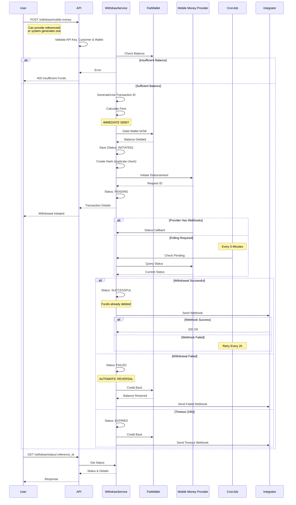
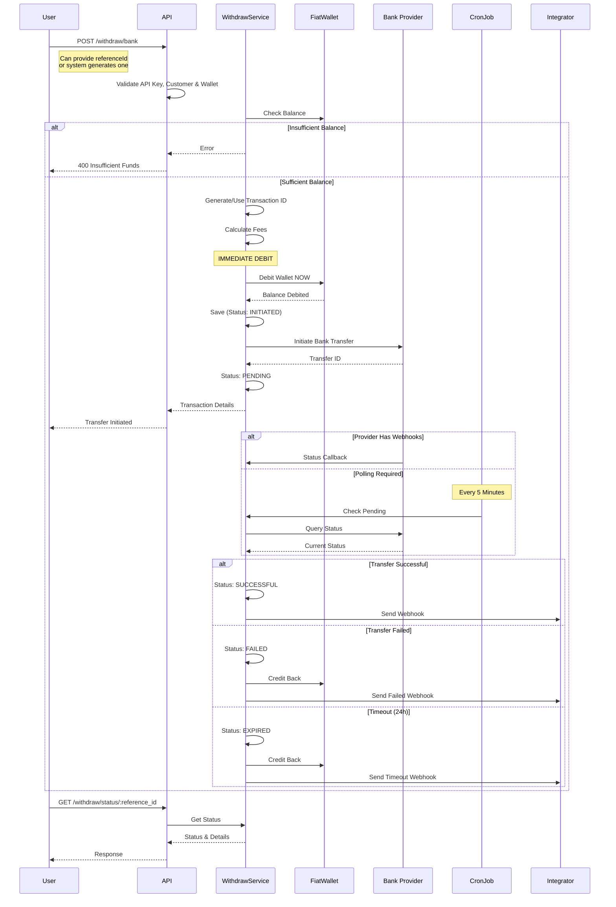
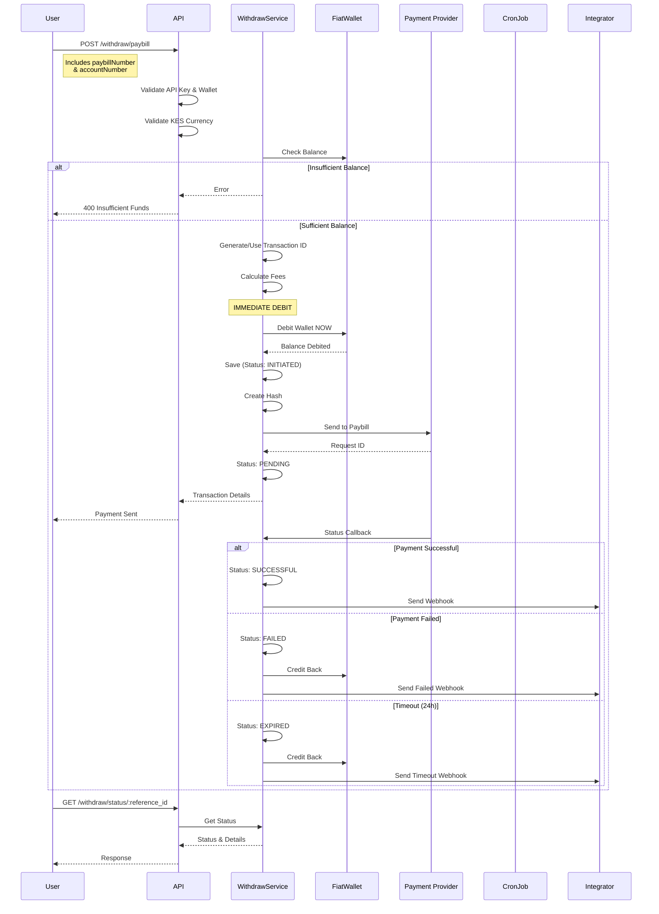

```mermaid
sequenceDiagram
    participant User
    participant API
    participant WithdrawService
    participant FiatWallet
    participant Provider as Payment Provider
    participant CronJob
    participant Integrator

    User->>API: POST /withdraw/lipa-na-mpesa
    Note right of User: Includes tillNumber
    API->>API: Validate API Key & Wallet
    API->>API: Validate KES Currency

    WithdrawService->>FiatWallet: Check Balance
    alt Insufficient Balance
        WithdrawService-->>API: Error
        API-->>User: 400 Insufficient Funds
    else Sufficient Balance
        WithdrawService->>WithdrawService: Generate/Use Transaction ID
        WithdrawService->>WithdrawService: Calculate Fees

        Note over WithdrawService: IMMEDIATE DEBIT
        WithdrawService->>FiatWallet: Debit Wallet NOW
        FiatWallet-->>WithdrawService: Balance Debited

        WithdrawService->>WithdrawService: Save (Status: INITIATED)
        WithdrawService->>WithdrawService: Create Hash

        WithdrawService->>Provider: Send to Till Number
        Provider-->>WithdrawService: Request ID
        WithdrawService->>WithdrawService: Status: PENDING
        WithdrawService-->>API: Transaction Details
        API-->>User: Payment Sent

        Provider->>WithdrawService: Status Callback

        alt Payment Successful
            WithdrawService->>WithdrawService: Status: SUCCESSFUL
            WithdrawService->>Integrator: Send Webhook

        else Payment Failed
            WithdrawService->>WithdrawService: Status: FAILED
            WithdrawService->>FiatWallet: Credit Back
            WithdrawService->>Integrator: Send Failed Webhook

        else Timeout (24h)
            WithdrawService->>WithdrawService: Status: EXPIRED
            WithdrawService->>FiatWallet: Credit Back
            WithdrawService->>Integrator: Send Timeout Webhook
        end
    end

    User->>API: GET /withdraw/status/:reference_id
    API->>WithdrawService: Get Status
    WithdrawService-->>API: Status & Details
    API-->>User: Response
```

## Mobile Money Withdrawal Flow

Disburse funds to mobile money wallets (M-PESA, MTN Money, Airtel Money, etc.)

### Flow Diagram



### Details

**Available Countries**: All supported countries

**Networks**: M-PESA, MTN Money, Airtel Money, Orange Money, and more
**Speed**: Instant to few minutes

**Key Points**:
- Funds debited IMMEDIATELY when withdrawal created
- If withdrawal fails, funds automatically reversed
- Hash-based duplicate prevention

---

## Bank Transfer Withdrawal Flow

Disburse funds to bank accounts.

### Flow Diagram



### Details

**Available Countries**: All supported countries

**Processing**: 1-3 business days
**Requirements**: Bank account number, bank code

**Key Points**:
- Funds debited immediately
- Longer settlement time than mobile money
- Automatic reversal on failure

---

## Lipa na M-Pesa Withdrawal Flow

Send payments to merchant till numbers (Kenya only).

### Flow Diagram



### Details

**Country**: Kenya only
**Currency**: KES
**Speed**: Instant

**Key Points**:
- No customer record needed
- Funds debited immediately
- Instant settlement

---

## Paybill Withdrawal Flow

Send payments to paybill numbers with account reference (Kenya only).

### Flow Diagram



### Details

**Country**: Kenya only
**Currency**: KES
**Speed**: Instant

**Key Points**:
- Requires paybill number and account reference
- No customer record needed
- Instant settlement

---

## Transaction Statuses

| Status | Description | Funds Status |
|--------|-------------|--------------|
| `INITIATED` | Transaction created, being processed | Debited |
| `PENDING` | Submitted to provider | Debited |
| `IN_PROGRESS` | Provider processing | Debited |
| `SUCCESSFUL` | Funds disbursed successfully | Debited (final) |
| `FAILED` | Disbursement failed | **Reversed** |
| `EXPIRED` | No confirmation within 24h | **Reversed** |
| `CANCELLED` | Transaction cancelled | **Reversed** |
| `DECLINED` | Provider declined | **Reversed** |
| `REVERSED` | Transaction reversed | **Reversed** |

---

## Common Features

### Immediate Wallet Debit
- Funds debited IMMEDIATELY at creation
- NOT reserved - actual debit happens instantly
- If withdrawal fails, funds automatically reversed
- No balance locking - clean debit/reverse flow

### Transaction ID
- Can be **integrator-provided** via `referenceId`
- Or **system-generated** if not provided
- Must be unique per integrator

### Automatic Reversal
When withdrawal fails or times out:
1. Status updated to FAILED/EXPIRED/REVERSED
2. Amount automatically credited back to wallet
3. Transaction recorded for audit
4. Webhook sent to notify integrator

### Duplicate Prevention
- Hash-based detection within same minute
- Composite: timestamp + integrator + phone
- Prevents accidental duplicates
- Returns error if duplicate detected

### Status Monitoring
- Webhook callbacks for instant updates
- Polling every 5 minutes for pending transactions
- 24-hour timeout for unconfirmed transactions

---

## Error Handling

### Insufficient Balance
```json
{
  "statusCode": 400,
  "message": "Insufficient funds in fiat wallet"
}
```

### Invalid Recipient
```json
{
  "status": "FAILED",
  "error": "Invalid mobile money number or bank account"
}
```

### Provider Timeout
```json
{
  "status": "EXPIRED",
  "error": "Withdrawal not confirmed within 24 hours",
  "note": "Funds reversed to wallet"
}
```

### Duplicate Transaction
```json
{
  "statusCode": 400,
  "message": "Transaction Denied",
  "note": "Duplicate detected within same minute"
}
```

### Duplicate Reference
```json
{
  "statusCode": 400,
  "message": "Duplicate referenceId"
}
```

### Wrong Currency (Lipa/Paybill)
```json
{
  "statusCode": 400,
  "message": "Lipa na M-Pesa/Paybill only available for Kenya (KES)"
}
```

---

## Best Practices

- **Validate Recipients**: Use `/customers/validate-mobile-money` before withdrawals
- **Unique References**: Always provide unique `referenceId` values
- **Implement Webhooks**: Set up webhook endpoint for real-time updates
- **Handle Reversals**: Monitor for FAILED/EXPIRED statuses - funds auto-reversed
- **Idempotency**: Safe to retry with same `referenceId` if request fails

---

## Testing

Use sandbox mode with test credentials provided in sandbox documentation.
